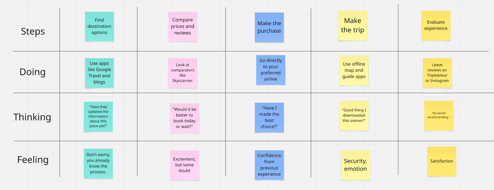
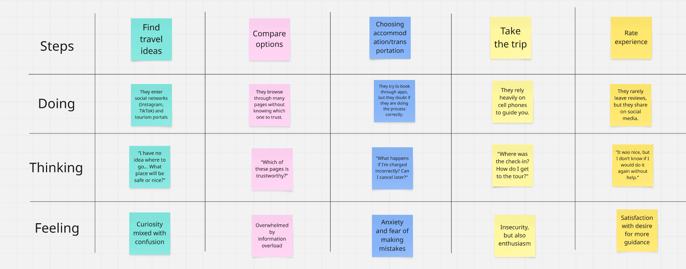
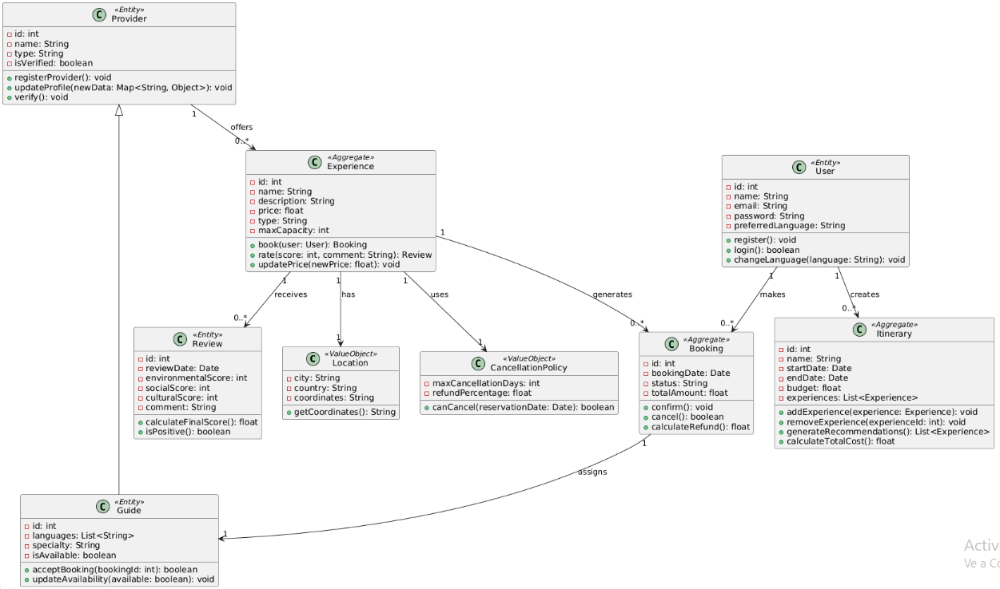

# report

Capítulo I: Introducción

1.1. Startup Profile

1.1.1. Descripción de la Startup

OpenSauce es un startup con enfoque en el mercado turístico, ofrecemos otras opciones a las guías turísticas convencionales, con nuestro software buscamos facilitar e impulsar el ecoturismo.

1.1.2. Perfiles de integrantes del equipo

1.2. Solution Profile

1.2.1 Antecedentes y problemática

#### Descripción de la problemática
EcoTrip es una plataforma digital orientada al sector del ecoturismo que busca conectar a viajeros con experiencias turísticas responsables, sostenibles y auténticas.Nuestro objetivo es promover destinos que respeten el medio ambiente y beneficien a las comunidades locales.

1.2.2 Lean UX Process.

#### What?

¿Cuál es el problema?

El problema que hemos encontrado es la falta de foco(reemplazar) que se dan a las comunidades locales al momento de la compra de ya sean servicios turisticos como guias o productos elaborados por los originarios

#### When?

¿Cuándo sucede el problema?

El problema sucede cuando los turistas optan por adquirir un plan turistico convencional en lugar de uno que cumpla con estandares ecoamigables, que no dañen el medio ambiente ni perjudiquen a las comunidades locales.

#### Where?

¿Dónde surge el problema?

El problema surge en destinos turisticos donde se ofrecen mayormente guias convencionales.

#### Who?

¿Quiénes estan involucrados?

Los principales involucrados son las personas que adquieren servicios turisticos y los locales de dichos destinos.

#### Why?

¿Cuál es la causa del problema?

La causa del problema es la falta de servicios turiscos que no afecten a al ambiente de manera significativa.

#### How?

¿Como se lleva a cabo los hechos?

Se llevan a cabo cuando un posible turista busca guias en plataformas de viaje y estas no ofrecen regularmente paquetes ecoamigables.

#### How Much?

¿Cual es la magnitud del problema?

La magnitud de esta problematica es grande puesto que afecta directamente a las vidas de muchas personas locales que afrontan las consecuencias como la alza de precios en servicios y productos ademas

1.2.2.1. Lean UX Problem Statements.

En la actualidad, los turistas eco amigables y conscientes enfrentan dificultades para encontrar guías que sean sostenibles, autenticas y que apoyen a las comunidades locales de forma directa, las opciones de turismo tradicional se enfocan en la rentabilidad que contribuye poco al cuidado del ambiente.

¿De que manera podemos ayudar a los turistas responsables a encontrar fácilmente estas experiencias?

1.2.2.2. Lean UX Assumptions.

Business Assumptions
Aplicación de fácil uso con una interfaz simple e intuitiva. -La aplicación será económicamente sostenible gracias a las comisiones por reserva según su tipo de servicio. -Negocios y guías locales interesados en plataformas que les permita conectar con ecoturistas en busca de experiencias únicas. -BoomNova se diferencia de otras plataformas de turismo por su enfoque en apoyar a las comunidades locales. -Existe un mercado de ecoturistas que está dispuesto a pagar más por experiencias eco amigables y auténticas.

User Assumptions
Los ecoturistas buscan experiencias que afecten de manera directa a las comunidades. -Los usuarios buscan una experiencia de búsqueda fácil y sencilla. -Los ecoturistas están dispuestos a pagar más siempre que se verifique que contribuimos a la a sostenibilidad de estas experiencias. -Los ecoturistas buscan experiencias distintas a las convencionales. -Los ecoturistas buscan tener un impacto positivo a los destinos que visitaron.

1.2.2.3. Lean UX Hypothesis Statements.

Creemos que si les ofrecemos a los turistas eco amigables una plataforma que los conecte directamente con guías y negocios locales que están comprometidos con la sostenibilidad más turistas utilizaran nuestro producto para planificar sus viajes. -Creemos que los negocios y guías locales sostenibles quieren aumentar su clientela, si creamos un espacio donde puedan ofrecer sus servicios y productos más negocios se registran a la plataforma. -Creemos que los ecoturistas -Creemos que los ecoturistas valoran el impacto de sus decisiones de viaje. Si ofrecemos información sobre cómo las experiencias apoyan a las comunidades y al medio ambiente, entonces los usuarios confiarán más en BoomNova. -Creemos que los usuarios prefieren plataformas fáciles de usar y que puedan confiar en ellas. Si diseñamos una experiencia de usuario intuitiva y con testimonios con resultados positivos, entonces aumentaremos el número de reservas en la plataforma.

1.2.2.4. Lean UX Canvas.

1.3. Segmentos objetivo.

## 1.3. Segmentos objetivo.

El ecoturismo en el Peru se considera un sector expansion con un crecimiento que supera el 13% anual hasta el año 2032. para ello identificamos:

El primer segmento objetivo como turistas responsables quienes buscan guias sostenibles, ademas de apoyar a la comunidad que ellos visitan.

El segundo segmento objetivo son proveedores turísticos sostenibles, el turismo sostenible es un mercado que esta en crecimiento en el Perú ya que es un pais con mucha riqueza natural y que ofrece una gran cantidad de destinos con poblaciones que tienen al turismo como fuente principal de ingresos.

Capítulo II: Requirements Elicitation & Analysis

2.1. Competidores.

- **Airbnb Experiences**: Es una plataforma de Airbnb que ofrece actividades únicas y auténticas diseñadas y guiadas por locales en diversas ciudades alrededor del mundo. A diferencia de los alojamientos tradicionales de Airbnb, las Experiencias se centran en vivir momentos memorables, aprender nuevas habilidades o descubrir la cultura local desde una perspectiva diferente.

  

- **GetYourGuide**: Es una plataforma global de reservas en línea especializada en experiencias turísticas, tours y actividades en destinos de todo el mundo. Funciona como un mercado digital donde los viajeros pueden descubrir y reservar excursiones, visitas guiadas, entradas a atracciones y actividades únicas con proveedores locales.

  

- **Visit.org**: Visit.org es una plataforma global de reservas de experiencias de viaje con impacto social, que conecta a viajeros con tours y actividades operados por organizaciones sin fines de lucro (ONGs) y empresas sociales alrededor del mundo. Su objetivo es promover un turismo sostenible y responsable, donde el dinero gastado en experiencias beneficie directamente a comunidades locales y causas sociales.

  

2.1.1. Análisis competitivo.

<table>
  <tr>
    <th colspan="6" valign="top">Competitive Analysis Landscape</th>
  </tr>
  <tr>
    <td colspan="2" valign="top">¿Por qué llevar a cabo este análisis?</td>
    <td colspan="4" valign="top">El objetivo de este análisis es identificar las características de los competidores y encontrar maneras de diferenciarnos.</td>
  </tr>
  <tr>
    <td colspan="2" rowspan="2" valign="top">Startup y Competidores</td>
    <td valign="top">EcoTrip</td>
    <td valign="top">Airbnb Experiences</td>
    <td valign="top">GetYourGuide</td>
    <td valign="top">Visit.org</td>
  </tr>
  <tr>
    <td valign="top"></td>
    <td valign="top"></td>
    <td valign="top"></td>
    <td valign="top"></td>
  </tr>
  <tr>
    <td rowspan="2" valign="top">Perfil</td>
    <td valign="top">Overview</td>
    <td valign="top">Plataforma que conecta viajeros con experiencias sostenibles, auténticas y responsables, priorizando el impacto ambiental y comunitario.</td>
    <td valign="top">Plataforma de Airbnb para experiencias guiadas por locales (culturales, gastronómicas, etc.).</td>
    <td valign="top">Plataforma global para reservar tours y actividades guiadas.</td>
    <td valign="top">Plataforma que ofrece actividades con impacto social y ambiental junto a ONGs y empresas sociales.</td>
  </tr>
  <tr>
    <td valign="top">Ventaja competitiva ¿Qué valor ofrece a los clientes?</td>
    <td valign="top">Diseño de experiencias sostenibles, conexión con comunidades indígenas, guías multilingües, impacto positivo medible.</td>
    <td valign="top">Fuerte comunidad de anfitriones y viajeros; integración con su app de alojamiento.</td>
    <td valign="top">Gran cobertura y variedad de actividades urbanas en múltiples idiomas.</td>
    <td valign="top">Enfoque exclusivo en impacto social con ONGs verificadas.</td>
  </tr>
  <tr>
    <td rowspan="2" valign="top">Perfil de Marketing</td>
    <td valign="top">Mercado objetivo</td>
    <td valign="top">Turistas responsables, viajeros eco-conscientes y proveedores turísticos sostenibles.</td>
    <td valign="top">Millennials, turistas urbanos, viajeros espontáneos.</td>
    <td valign="top">Turistas internacionales y locales que buscan tours estructurados.</td>
    <td valign="top">Empresas que quieren promover el turismo con impacto social.</td>
  </tr>
  <tr>
    <td valign="top">Estrategias de marketing</td>
    <td valign="top">Alianzas con ONGs, influencers sostenibles, campañas educativas.</td>
    <td valign="top">Marketing por redes sociales, publicidad en la app, boca a boca.</td>
    <td valign="top">SEO, anuncios pagados, campañas de video marketing.</td>
    <td valign="top">Alianzas B2B con ONGs y empresas.</td>
  </tr>
  <tr>
    <td rowspan="3" valign="top">Perfil de Producto</td>
    <td valign="top">Productos & Servicios</td>
    <td valign="top">Experiencias, voluntariados, guías locales, itinerarios inteligentes.</td>
    <td valign="top">Experiencias locales, clases, tours y talleres.</td>
    <td valign="top">Tours, tickets a atracciones, visitas guiadas.</td>
    <td valign="top">Actividades solidarias y de impacto (voluntariado, talleres).</td>
  </tr>
  <tr>
    <td valign="top">Precios & Costos</td>
    <td valign="top">Comisión por reserva (transparente), servicios premium opcionales.</td>
    <td valign="top">Comisión en cada experiencia + tarifa del anfitrión.</td>
    <td valign="top">Comisión y precios fijos por actividad.</td>
    <td valign="top">Costos varían según la ONG; comisión para Visit.org.</td>
  </tr>
  <tr>
    <td valign="top">Canales de distribución (Web y/o Móvil)</td>
    <td valign="top">Web y/o móvil</td>
    <td valign="top">Web y App móvil</td>
    <td valign="top">Web y App móvil</td>
    <td valign="top">Web (limitado en app)</td>
  </tr>
  <tr>
    <td rowspan="4" valign="top">Análisis SWOT</td>
    <td valign="top">Fortalezas</td>
    <td valign="top">Enfoque ecológico y social, propuesta diferenciada, nicho emergente.</td>
    <td valign="top">Marca reconocida, red global, integración con hospedajes.</td>
    <td valign="top">Amplia oferta, multilenguaje, presencia global.</td>
    <td valign="top">Alta credibilidad social, alianza con ONGs, impacto real.</td>
  </tr>
  <tr>
    <td valign="top">Debilidades</td>
    <td valign="top">Plataforma nueva, baja visibilidad, dependencia de terceros.</td>
    <td valign="top">Algunas experiencias no verificadas, saturación de oferta.</td>
    <td valign="top">Falta de personalización, enfoque más comercial.</td>
    <td valign="top">Oferta limitada geográficamente, poca variedad.</td>
  </tr>
  <tr>
    <td valign="top">Oportunidades</td>
    <td valign="top">Creciente interés por el ecoturismo, apoyo a lo local, viajeros conscientes.</td>
    <td valign="top">Expansión de experiencias virtuales.</td>
    <td valign="top">Crecimiento del turismo.</td>
    <td valign="top">Aumento del interés por turismo con propósito.</td>
  </tr>
  <tr>
    <td valign="top">Amenazas</td>
    <td valign="top">Competencia consolidada, regulación turística, baja adopción tecnológica local.</td>
    <td valign="top">Legislación local, críticas por experiencias no auténticas.</td>
    <td valign="top">Competencia con Airbnb y nuevas plataformas.</td>
    <td valign="top">Bajo conocimiento de marca en algunos países.</td>
  </tr>
</table>

2.1.2. Estrategias y tácticas frente a competidores.

Las estrategias de EcoTrip frente a sus competidores son:

- Evaluación sostenible verificada: A diferencia de Airbnb o Lokafy, todas las experiencias en EcoTrip pasarán por una validación basada en criterios ambientales, sociales y culturales.

- Asistencia personalizada con itinerarios inteligentes: Una herramienta gratuita para armar viajes a medida y un servicio premium para optimizar experiencias según presupuesto, tiempo e impacto.

- Servicio multilingüe y culturalmente contextualizado: Conexión entre turistas y guías que no solo hablen su idioma, sino que comprendan sus referencias culturales.

- Modelo inclusivo para proveedores pequeños: Plan freemium para que guías y comunidades puedan tener presencia en la plataforma sin costo inicial.

  2.2. Entrevistas.

  2.2.1. Diseño de entrevistas.

**Turistas Responsables**

- ¿Qué te motiva a viajar?
  (Explora si buscan aventura, relajación, conexión cultural, etc.)

- ¿Has participado antes en actividades de turismo sostenible o comunitario? ¿Cómo fue tu experiencia?

- ¿Qué factores tomas en cuenta al elegir un destino o experiencia turística?

- ¿Qué tan importante es para ti el impacto ambiental y social del lugar o actividad que visitas?

- ¿Qué canales usas normalmente para planear o reservar tus viajes? (Webs, apps, redes sociales, agencias, etc.)

- ¿Cuáles han sido tus principales frustraciones al buscar experiencias de viaje más auténticas o sostenibles?

- ¿Qué dispositivos usas normalmente para organizar tus viajes? (Laptop, smartphone, tablet)

**Proveedores Sostenibles**

- ¿Cómo describirías los servicios o experiencias que ofreces a los turistas?

- ¿Qué te motivó a ofrecer experiencias turísticas sostenibles o comunitarias?

- ¿Cuáles son tus principales desafíos para atraer y conectar con turistas?

- ¿Qué medios usas actualmente para promocionar tus servicios? ¿Con qué frecuencia los usas?

- ¿Qué tipo de turistas suelen visitarte? ¿Qué valoran más de lo que ofreces?

- ¿Has tenido alguna experiencia con plataformas digitales de turismo? ¿Cómo fue?

- ¿Qué mejoras te gustaría ver en la forma de promocionar y gestionar tus experiencias?

  2.2.2. Registro de entrevistas.

#### Entrevista 1 - Cliente

**Entrevistador:** Anderson Gonza

**Entrevistado:** Salvador Salinas

Edad: 23 años

Ocupación: Programador freelance

Residencia: Lima, Perú

**Link de la entrevista:** https://upcedupe-my.sharepoint.com/:v:/g/personal/u202120836_upc_edu_pe/EdIFRKsWsE5NkDlJaW2rn24BLqDtL3K0gaUY9ADINi2FhQ?nav=eyJyZWZlcnJhbEluZm8iOnsicmVmZXJyYWxBcHAiOiJPbmVEcml2ZUZvckJ1c2luZXNzIiwicmVmZXJyYWxBcHBQbGF0Zm9ybSI6IldlYiIsInJlZmVycmFsTW9kZSI6InZpZXciLCJyZWZlcnJhbFZpZXciOiJNeUZpbGVzTGlua0NvcHkifX0&e=Fkm3lW

  

#### Resumen de la entrevista

Salvador es un programador freelance que viaja solo con mochila, buscando autenticidad y mínimo impacto ambiental. Ha hecho voluntariados de reforestación y organiza sus viajes desde su smartphone usando Instagram y blogs. Le frustra no encontrar fácilmente experiencias verdaderamente auténticas.

#### Entrevista 2 - Cliente

**Entrevistador:** Anderson Gonza

**Entrevistado:** Marcos

Edad: 20 años

Ocupación: Estudiante de Ingeniería Ambiental

Residencia: Lima, Perú

**Link de la entrevista:** https://upcedupe-my.sharepoint.com/:v:/g/personal/u202120836_upc_edu_pe/Ecn81ZUtC0lIkv0iftk907QBCUFv5cW5h4287FDTk1YFZg?nav=eyJyZWZlcnJhbEluZm8iOnsicmVmZXJyYWxBcHAiOiJPbmVEcml2ZUZvckJ1c2luZXNzIiwicmVmZXJyYWxBcHBQbGF0Zm9ybSI6IldlYiIsInJlZmVycmFsTW9kZSI6InZpZXciLCJyZWZlcnJhbFZpZXciOiJNeUZpbGVzTGlua0NvcHkifX0&e=rXdblg

  

#### Resumen de la entrevista

Marcos estudia ingeniería ambiental y viaja para aprender y colaborar directamente en conservación. Ha trabajado en rescates de animales en la selva y busca proyectos donde pueda involucrarse de verdad. Le molesta la falta de transparencia sobre el impacto real de muchas experiencias turísticas.

#### Entrevista 3 - Cliente

**Entrevistador:** Anderson Gonza

**Entrevistado:** Oscar

Edad: 22 años

Ocupación: Estudiante de Administración de Empresas

Residencia: Lima, Perú

**Link de la entrevista:** https://upcedupe-my.sharepoint.com/:v:/g/personal/u202120836_upc_edu_pe/EeFNDUDzBBxHk-pqT2t1R4kBIZztjxTs9ATdjn360LJ90g?nav=eyJyZWZlcnJhbEluZm8iOnsicmVmZXJyYWxBcHAiOiJPbmVEcml2ZUZvckJ1c2luZXNzIiwicmVmZXJyYWxBcHBQbGF0Zm9ybSI6IldlYiIsInJlZmVycmFsTW9kZSI6InZpZXciLCJyZWZlcnJhbFZpZXciOiJNeUZpbGVzTGlua0NvcHkifX0&e=yI1daS

  

#### Resumen de la entrevista

Oscar, estudiante de administración, viaja con amigos para desconectarse de la rutina. Le gustan los destinos únicos y económicos, y aunque antes no pensaba en el impacto social o ambiental, ahora sí lo valora. Se inspira en TikTok e Instagram, pero le cuesta confiar en que las experiencias sean realmente sostenibles.

#### Entrevista 4 - Provedor

**Entrevistador:** Anderson Gonza

**Entrevistado:** Joaquin

Edad: 27 años

Rol: Propietario de un ecohostal en Oxapampa

Tipo: Emprendimiento ecológico privado

**Link de la entrevista:** https://upcedupe-my.sharepoint.com/:v:/g/personal/u202120836_upc_edu_pe/EVwxh00o199Mt8Xyh5limHABwAnrKvxi8nO9BWHetalSrA?nav=eyJyZWZlcnJhbEluZm8iOnsicmVmZXJyYWxBcHAiOiJPbmVEcml2ZUZvckJ1c2luZXNzIiwicmVmZXJyYWxBcHBQbGF0Zm9ybSI6IldlYiIsInJlZmVycmFsTW9kZSI6InZpZXciLCJyZWZlcnJhbFZpZXciOiJNeUZpbGVzTGlua0NvcHkifX0&e=Oa3bhT

  

#### Resumen de la entrevista

Joaquín dirige un ecohostal en Oxapampa donde mezcla naturaleza, gastronomía local y rutas poco conocidas. Aunque Airbnb e Instagram lo ayudan a atraer turistas, le gustaría menos dependencia de plataformas y más apoyo para destacar su propuesta ecológica auténtica.

#### Entrevista 5 - Provedor

**Entrevistador:** Anderson Gonza

**Entrevistado:** Lizeth

Edad: 26 años

Rol: Coordinadora de programas de conservación en una ONG ambiental en Tarapoto.

Tipo: Organización sin fines de lucro

**Link de la entrevista:** https://upcedupe-my.sharepoint.com/:v:/g/personal/u202120836_upc_edu_pe/EUwfonQnWXVLoY9hKMP6mxMBNzYCQ68ym8faLh5DOd50xA?nav=eyJyZWZlcnJhbEluZm8iOnsicmVmZXJyYWxBcHAiOiJPbmVEcml2ZUZvckJ1c2luZXNzIiwicmVmZXJyYWxBcHBQbGF0Zm9ybSI6IldlYiIsInJlZmVycmFsTW9kZSI6InZpZXciLCJyZWZlcnJhbFZpZXciOiJNeUZpbGVzTGlua0NvcHkifX0&e=Z8aIda

  

#### Resumen de la entrevista

Lizet coordina voluntariados de conservación en Tarapoto a través de una ONG. Trabaja duro para acercar a jóvenes a causas ambientales reales, pero a veces le cuesta transmitir el valor de estas experiencias. Sueña con una red que priorice proyectos pequeños con impacto genuino.

#### Entrevista 6 - Provedor

**Entrevistador:** Anderson Gonza

**Entrevistado:** Luis Quispe

Edad: 25 años

Rol: Líder joven de una comunidad que ofrece caminatas con guías locales en Cusco.

Tipo: Comunidad rural

**Link de la entrevista:** https://upcedupe-my.sharepoint.com/:v:/g/personal/u202120836_upc_edu_pe/EUdLuGiA06VDpBGteTFbhyIB_9ZJuZgivAOjZQ8Jj0vthA?nav=eyJyZWZlcnJhbEluZm8iOnsicmVmZXJyYWxBcHAiOiJPbmVEcml2ZUZvckJ1c2luZXNzIiwicmVmZXJyYWxBcHBQbGF0Zm9ybSI6IldlYiIsInJlZmVycmFsTW9kZSI6InZpZXciLCJyZWZlcnJhbFZpZXciOiJNeUZpbGVzTGlua0NvcHkifX0&e=6TbLRD

  

#### Resumen de la entrevista

Luis lidera una comunidad en Cusco que ofrece caminatas ancestrales y talleres culturales. Su gran reto es competir con agencias grandes y hacerse visible online. Usa Instagram y WhatsApp, y quisiera que se reconozca más el valor real de las experiencias comunitarias.

2.2.3. Análisis de entrevistas.

### Segmento: Turistas Jóvenes

#### Perfil General:

Edad: 20 a 23 años

Residencia: Lima, Perú

Ocupación: Estudiantes universitarios y profesionales jóvenes

Modalidad de viaje: Viajan solos o en grupos de amigos

Motivaciones de viaje: Búsqueda de experiencias auténticas, conexión con la naturaleza y aprendizaje cultural​

#### Características Comunes:

Conciencia ambiental: Muestran preocupación por el impacto ambiental y social de sus viajes.

Participación en turismo sostenible: El 100% ha participado en actividades de turismo sostenible o comunitario.

Canales de planificación: Todos utilizan redes sociales y plataformas digitales para planificar sus viajes.

Frustraciones comunes: El 100% expresa dificultades para identificar experiencias verdaderamente sostenibles y evitar el "greenwashing"(publicidad engañosa).

### Segmento: Proveedores de Turismo Sostenible

#### Perfil General:

Edad: 25 a 30 años

Ubicación: Regiones como Cusco, Oxapampa y Tarapoto

Tipo de organización: Comunidad rural, emprendimiento ecológico privado y ONG ambiental

Roles: Líder comunitario, propietario de ecohostal y coordinador de programas de conservación​

#### Características Comunes:

Oferta de servicios: El 100% ofrece experiencias auténticas que incluyen actividades culturales, educativas y de conservación.

Motivación: Todos están motivados por la preservación cultural y ambiental, así como por el desarrollo sostenible de sus comunidades.

Canales de promoción: Todos utilizan plataformas digitales como Instagram, Airbnb y Booking para promocionar sus servicios.

Desafíos comunes: El 100% enfrenta dificultades para competir con grandes operadores turísticos y lograr visibilidad en plataformas digitales.​

2.3. Needfinding.

Con el propósito de desarrollar una app que satisfaga las necesidades particulares de los usuarios, Ecotrip llevará a cabo la identificación del User persona, User Task Matrix, User Journey Maps y Empathy Mapping.

2.3.1. User Personas.

Para esta sección se han creado personajes ficticios, cada uno diseñado para representar a un segmento específico de usuarios. La información utilizada para desarrollar estos "User personas" proviene de entrevistas previas realizadas a cada segmento objetivo. Estas entrevistas tenían como objetivo comprender mejor a las personas a las que se dirige la aplicación. Se consideraron datos demográficos, metas, motivaciones, frustraciones, marcas relacionadas con el tema de la aplicación, canales digitales más utilizados, entre otros. La creación de esta sección se llevó a cabo utilizando la plataforma UXPressia.

- **Segmento objetivo: Programador Freelance y Turista**

2.3.2. User Task Matrix.

En esta sección se presenta el user task matrix, herramienta centrada en los segmentos objetivos, que nos permitirá identificar las tareas y objetivos claves de los usuarios. Además, nos permitirá priorizar características y funcionalidades al momento de realizar el product backlog. Para la frecuencia se han considerado cinco opciones:nunca ,casi nunca, a veces, a menudo ,siempre; y para la importancia tres opciones: bajo, medio, alto". En relación con la matriz de tareas de los usuarios, podemos identificar tanto las tareas de mayor frecuencia como las de mayor importancia, así como las diferencias y similitudes entre los diferentes tipos de usuarios.

<table><tr><th rowspan="2" valign="top"><b><i>User task Matrix</i></b></th><th colspan="2" valign="top"><b><i>Salvador Salinas</i></b></th><th colspan="2" valign="top">
<b><i>xxxxxxxxxx</i></b> 

<b><i></i></b>
</th></tr>
<tr><td valign="top"><b><i>Frecuencia</i></b> </td><td valign="top"><b><i>Importancia</i></b></td><td valign="top"><b><i>Frecuencia</i></b> </td><td valign="top"><b><i>Importancia</i></b></td></tr>
<tr><td>Registrarse</td><td><b><i>Una vez</i></b></td><td><b><i>Alta</i></b></td><td><b><i>Una vez</i></b></td><td><b><i>Alta</i></b></td></tr>
<tr><td>Iniciar sesión</td><td><b><i>Siempre</i></b></td><td><b><i>Alta</i></b></td><td><b><i>Siempre</i></b></td><td><b><i>Alta</i></b></td></tr>
<tr><td>Buscar tours</td><td><b><i>Siempre</i></b></td><td><b><i>Alta</i></b></td><td><b><i>Siempre</i></b></td><td><b><i>Alta</i></b></td></tr>
<tr><td>Reservar tours</td><td><b><i>Siempre</i></b></td><td><b><i>Alta</i></b></td><td><b><i>Siempre</i></b></td><td><b><i>Alta</i></b></td></tr>
<tr><td>Crear reseñas/comentarios</td><td><b><i>Siempre</i></b></td><td><b><i>Media</i></b></td><td><b><i>Siempre</i></b></td><td><b><i>Media</i></b></td></tr>
<tr><td>Editar perfil</td><td><b><i>Siempre</i></b></td><td><b><i>Alta</i></b></td><td><b><i>Siempre</i></b></td><td><b><i>Alta</i></b></td></tr>
<tr><td>Guardar tours favoritos</td><td><b><i>Siempre</i></b></td><td><b><i>Medio</i></b></td><td><b><i>Siempre</i></b></td><td><b><i>Medio</i></b></td></tr>
<tr><td>Recibir recomendaciones personalizadas</td><td><b><i>A veces</i></b></td><td><b><i>Baja</i></b></td><td><b><i>Casi nunca</i></b></td><td><b><i>Baja</i></b></td></tr>
</table>

**Para los Turistas Frecuentes, las tareas más importantes y recurrentes incluyen:**

- Buscar y reservar tours: Son actividades clave que definen su experiencia continua en la plataforma, por lo tanto tienen una frecuencia alta y una importancia alta.
- Guardar tours favoritos: Les permite planificar y comparar opciones, mejorando la experiencia personalizada.
- Recibir recomendaciones personalizadas: Es fundamental para facilitarles nuevas experiencias alineadas con sus intereses, por eso es tanto frecuente como valiosa.
- Iniciar sesión y editar perfil: Aunque rutinarias, son necesarias para una navegación fluida.

**Por otro lado, para los Turistas Ocasionales, las tareas más relevantes son:**

- Registrarse e iniciar sesión: Aunque menos frecuentes, son esenciales para acceder a cualquier funcionalidad dentro de la plataforma.
- Reservar tours: A pesar de ser usada ocasionalmente, tiene una alta importancia cuando ocurre.
- Buscar tours: Se realiza con menos frecuencia, pero es clave en su momento de decisión.

Ambos tipos de turistas comparten el interés por reservar tours y acceder al contenido básico, pero las funcionalidades como recomendaciones o guardar favoritos son significativamente más relevantes para los usuarios frecuentes. Esto refleja las diferentes necesidades y comportamientos entre quienes usan la plataforma esporádicamente frente a quienes la integran en su estilo de vida viajero.

2.3.3. User Journey Mapping.

En esta sección, se describen en detalle los User Journey Mapping para dos perfiles distintos de usuarios de la plataforma de turismo responsable: los Turistas Ocasionales y los Turistas Frecuentes. Estos mapas proporcionan una visión integral del recorrido que cada tipo de usuario realiza dentro del sistema, desde el primer contacto con la plataforma hasta su uso habitual y su interacción continua con las funcionalidades ofrecidas. Se destacan las etapas clave, las emociones y necesidades específicas de cada usuario, para asegurar una comprensión clara de su experiencia global.

_Para Turistas Ocasionales_

- El recorrido del Turista Ocasional comienza generalmente por la búsqueda de opciones de viaje de manera espontánea, motivado por una necesidad puntual de escapar de la rutina o aprovechar una oportunidad (vacaciones, feriados, etc.). Su primer contacto con la plataforma suele ser a través de búsquedas orgánicas o recomendaciones de terceros.

- Una vez dentro, realiza el registro para poder acceder a contenido completo y proceder con la reserva de un tour. La experiencia debe ser intuitiva y sin fricción, ya que este tipo de usuario no está habituado a navegar frecuentemente por plataformas de este tipo.
- Después de su experiencia en el tour, puede dejar una reseña ocasional, aunque en muchos casos no vuelve a usar la plataforma a corto plazo, a menos que se generen recordatorios o recomendaciones personalizadas en el futuro.

_Para Turistas Frecuentes_

- El Turista Frecuente tiene un comportamiento más estratégico y constante. Su viaje inicia incluso antes del registro, con una exploración activa de opciones, muchas veces comparando múltiples experiencias de turismo responsable.
- Este usuario se registra con la intención de aprovechar funcionalidades avanzadas como guardar tours favoritos, recibir recomendaciones personalizadas, y gestionar múltiples reservas. Navega regularmente la plataforma, mantiene actualizado su perfil, y deja reseñas de sus experiencias, valorando la posibilidad de interactuar con la comunidad y contribuir a la mejora de los servicios ofrecidos.
- Su viaje es cíclico: busca, compara, reserva, evalúa, y repite. A lo largo del tiempo, se convierte en un embajador de la marca, recomendando la plataforma a otros viajeros y contribuyendo activamente a la mejora de los contenidos.

Tanto los Turistas Ocasionales como los Turistas Frecuentes comparten el deseo de acceder a experiencias significativas y auténticas de turismo responsable. Sin embargo, sus interacciones con la plataforma difieren en profundidad y frecuencia.

- #### _Turistas Ocasionales_

  | Etapa                    | Acción del usuario (Turista ocasional)       | Emoción      | Canal               | Oportunidad de mejora                          |
  | ------------------------ | -------------------------------------------- | ------------ | ------------------- | ---------------------------------------------- |
  | Descubrimiento           | Encuentra la plataforma por redes o buscador | Curiosidad   | Web, redes sociales | Mejorar posicionamiento SEO y contenido visual |
  | Registro                 | Se registra para ver detalles de un tour     | Interés      | Página web          | Simplificar el proceso de registro             |
  | Exploración              | Navega tours sin un objetivo claro           | Confusión    | Navegador           | Sugerencias iniciales según localización       |
  | Reserva                  | Selecciona y reserva un tour                 | Satisfacción | Página de reservas  | Ofrecer asistencia en tiempo real              |
  | Participación en el tour | Asiste a la actividad                        | Entusiasmo   | Presencial          | Recordatorios y checklist antes del tour       |
  | Post-experiencia         | Puede dejar una reseña o no                  | Desconexión  | Email, web          | Incentivar feedback con recompensas            |

- #### _Turistas Frecuentes_

  | Etapa                    | Acción del usuario (Turista frecuente)    | Emoción     | Canal             | Oportunidad de mejora                   |
  | ------------------------ | ----------------------------------------- | ----------- | ----------------- | --------------------------------------- |
  | Descubrimiento           | Visita frecuente para buscar nuevos tours | Entusiasmo  | App, web          | Notificaciones personalizadas           |
  | Registro                 | Ya registrado                             | Confianza   | Web/App           | Acceso rápido con login automático      |
  | Exploración              | Usa filtros, compara, guarda favoritos    | Seguridad   | App, navegador    | Mostrar experiencias similares          |
  | Reserva                  | Reserva múltiples tours                   | Expectativa | Plataforma        | Ofrecer paquetes personalizados         |
  | Participación en el tour | Asiste a las actividades                  | Entusiasmo  | Presencial        | Opciones de compartir en redes sociales |
  | Post-experiencia         | Deja reseña y comparte experiencia        | Compromiso  | Web, email, redes | Programa de fidelización o referidos    |

  2.3.4. Empathy Mapping.

En esta sección se aborda el Empathy Mapping, una herramienta esencial para elaborar perfiles detallados de los user personas y profundizar en la comprensión de su perspectiva y experiencia. Cada user persona se analiza a través de cinco elementos cruciales: lo que el usuario ve, escucha,dice, hace y siente. Además, se identifican los problemas (pains) y beneficios (gains) de acuerdo con una serie de preguntas estratégicas:¿Qué preocupaciones o desafíos enfrenta el usuario en su trabajo diario?¿Qué mejoras o soluciones podrían resolver los problemas identificados?¿Qué argumentos podrían persuadir al usuario de que nuestra solución es la mejor opción para satisfacer sus necesidades profesionales?

En esta sección se aborda el Empathy Mapping, una herramienta esencial para construir perfiles detallados de los user personas y profundizar en la comprensión de su perspectiva y experiencia durante la interacción con la plataforma. Este análisis se ha estructurado considerando cinco elementos clave: lo que el usuario ve, escucha, dice, hace y siente, además de identificar los problemas (pains) y beneficios (gains) que marcan su recorrido y necesidades.

- **Segmento: Turistas Frecuentes**

| Etapa                | Registro                            | Búsqueda de tours                      | Reserva                               | Experiencia del tour                        | Revisión y seguimiento                     |
| -------------------- | ----------------------------------- | -------------------------------------- | ------------------------------------- | ------------------------------------------- | ------------------------------------------ |
| **User goals**       | Acceder rápidamente a su cuenta     | Encontrar experiencias únicas y nuevas | Reservar sin repetir datos            | Tener un servicio ágil y profesional        | Dejar feedback o repetir experiencia       |
| **Touchpoints**      | Login con Google/Facebook           | Filtros avanzados, tours recomendados  | Perfil guardado con datos precargados | Confirmaciones automáticas, asistencia 24/7 | Correo de agradecimiento, link a favoritos |
| **Customer Thought** | “Ya tengo cuenta, quiero entrar ya” | “¿Hay algo nuevo o diferente?”         | “¿Puedo reservar en 2 clics?”         | “¿Tendré soporte si algo falla?”            | “¿Vale la pena repetir o recomendar?”      |
| **Experience**       | 😄 Rápida y eficiente               | 🙂 Curiosa y motivada                  | 😄 Satisfactoria                      | 😄 Profesional y sin contratiempos          | 😄 Positiva y leal                         |
| **Ideas/Opps**       | Recordar sesión automáticamente     | Notificaciones de nuevos tours         | Botón de reserva rápida               | Chatbot o número de contacto directo        | Programa de recompensas o referidos        |

- **Segmento: Turistas Ocasionales**

| Etapa                | Registro                        | Búsqueda de tours                              | Reserva                              | Experiencia del tour                  | Revisión y seguimiento          |
| -------------------- | ------------------------------- | ---------------------------------------------- | ------------------------------------ | ------------------------------------- | ------------------------------- |
| **User goals**       | Crear cuenta fácilmente         | Encontrar un tour accesible sin mucho esfuerzo | Reservar rápido y sin complicaciones | Tener una experiencia guiada y clara  | Confirmar que todo salió bien   |
| **Touchpoints**      | Registro con email o Google     | Tours destacados, búsqueda sencilla            | Pasarela de pago clara y guiada      | Instrucciones por correo/WhatsApp     | Enlace a reseña, agradecimiento |
| **Customer Thought** | “¿Esto es fácil o toma tiempo?” | “¿Este tour vale la pena?”                     | “¿Es seguro pagar aquí?”             | “¿Sabré a dónde ir y qué hacer?”      | “¿Debo dejar una opinión?”      |
| **Experience**       | 🙂 Intuitiva                    | 😐 Un poco indecisa                            | 🙂 Clara y sin estrés                | 🙂 Cómoda y bien organizada           | 🙂 Positiva, pero breve         |
| **Ideas/Opps**       | Acceso simplificado o invitado  | Mostrar reseñas visibles y puntuación          | Asistente visual durante la reserva  | Alertas automáticas y contacto rápido | Incentivo por dejar reseña      |

2.3.5. As-is Scenario Mapping.

En esta sección se presenta el As-is Scenario Mapping para cada uno de los segmentos de usuarios identificados: Turistas Frecuentes y Turistas Ocasionales. Este análisis tiene como objetivo visualizar cómo interactúan actualmente estos usuarios con plataformas digitales para planificar y reservar experiencias de viaje, y así detectar puntos de mejora, frustraciones y oportunidades no exploradas.

El proceso contempla las siguientes fases clave: Descubrimiento, Evaluación, Reserva, Experiencia y Seguimiento. En cada una se destacan tanto los aspectos positivos como negativos vividos por los usuarios, así como las áreas en las que aún se requiere mayor investigación.

_As-is Scenario mapping: Turistas Frecuentes_

_As-is Scenario mapping: Turistas Ocasionales_

2.4. Ubiquitous Language.

Capítulo III: Requirements Specification

3.1. To-Be Scenario Mapping.

3.2. User Stories.

3.3. Impact Mapping.

#### Mapa de segmento turistas responsable:

#### Mapa de segmento proveedores turisticos ecologicos:

3.4. Product Backlog.

|ID | Título | Prioridad | Descripción|
|--------------|--------------|--------------|--------------|
|US-01 | Ver lista de experiencias sostenibles | Alta | Como turista ocasional quiero ver una lista de experiencias para explorar qué ofrece EcoTrip.|
|US-01.1 | Filtrar experiencias por tipo | Alta | Como turista frecuente quiero filtrar experiencias por tipo para encontrar lo que me interesa.|
|US-02 | Registro de proveedores | Alta | Como proveedor quiero registrarme para ofrecer mis servicios turísticos sostenibles.|
|US-02.1 | Aprobación de proveedor | Alta | Como administrador quiero revisar y aprobar solicitudes de proveedores.|
|US-03 | Crear plan de viaje personalizado | Media | Como turista frecuente quiero armar mi propio itinerario con actividades y hospedajes.|
|US-03.1 | Sugerencias de itinerario basadas en intereses | Media | Como turista ocasional quiero recibir sugerencias de actividades según mi perfil.|
|US-04 | Conexión con guías turísticos | Alta | Como turista frecuente quiero contactar guías que hablen mi idioma.|
|US-04.1 | Reservar guía específico | Media | Como turista ocasional quiero poder reservar a un guía en específico.|
|US-05 | Reservar y pagar experiencias | Alta | Como turista frecuente quiero reservar y pagar actividades de manera fácil.|
|US-05.1 | Cancelar reserva y recibir reembolso | Media | Como turista ocasional quiero cancelar mi reserva si no podré asistir.|
|US-06 | Página informativa sobre EcoTrip | Media | Como visitante quiero saber qué es EcoTrip y qué servicios ofrece.|
|US-06.1 | Ver testimonios de otros viajeros | Baja | Como visitante quiero leer opiniones para confiar en la plataforma.|
|US-07 | Gestión del portafolio de proveedores | Alta | Como proveedor quiero agregar, editar o eliminar mis experiencias.|
|US-08 | Mejorar visibilidad de proveedores | Media | Como proveedor quiero mostrar mis calificaciones y reseñas públicas.|
|US-09 | Registro y validación fácil para proveedores | Alta | Como proveedor quiero un proceso de registro rápido y sencillo.|
|US-10 | Recibir pagos seguros como proveedor | Alta | Como proveedor quiero recibir mis pagos de manera segura y poder ver mi historial.|

Capítulo IV: Product Design

4.1. Style Guidelines.

4.1.1. General Style Guidelines.

4.1.2. Web Style Guidelines.

4.2. Information Architecture.

4.2.1. Organization Systems.

4.2.2. Labeling Systems.

4.2.3. SEO Tags and Meta Tags

4.2.4. Searching Systems.

4.2.5. Navigation Systems.

4.3. Landing Page UI Design.

4.3.1. Landing Page Wireframe.

4.3.2. Landing Page Mock-up.

4.4. Web Applications UX/UI Design.

En esta seccion se presentaran los wireframes y mock-ups de la aplicacion web.

4.4.1. Web Applications Wireframes.

4.4.2. Web Applications Wireflow Diagrams.

Se adjunta el link de lucidchart https://lucid.app/lucidchart/3388aa61-c9d7-4ea5-b07a-c336cde96596/edit?viewport_loc=-1485%2C1449%2C8552%2C4006%2C0_0&invitationId=inv_be371db9-279a-4ba4-8a9f-60ce9f108df5

4.4.3. Web Applications Mock-ups.

4.4.4. Web Applications User Flow Diagrams.

Se adjunta el link de lucidchart https://lucid.app/lucidchart/d14987cc-bb04-4407-bde7-c9ce172c96c4/edit?viewport_loc=-5452%2C3770%2C10959%2C5134%2C0_0&invitationId=inv_623075fb-44b7-4c97-939c-7a03784fb502

4.5. Web Applications Prototyping.

4.6. Domain-Driven Software Architecture.

4.6.1. Software Architecture Context Diagram.

4.6.2. Software Architecture Container Diagrams.

4.6.3. Software Architecture Components Diagrams.

4.7. Software Object-Oriented Design.

4.7.1. Class Diagrams.

Se realizo el diagrama de clases

  

4.7.2. Class Dictionary.

### 1. User Bounded Context

#### User (Aggregate)

La clase **User** contiene los datos de autenticación y los detalles generales de un usuario en la plataforma (ya sea un viajero o proveedor).

#### Atributos:

- `id: int` – Identificador único del usuario.
- `name: String` – Nombre completo del usuario.
- `email: String` – Correo electrónico del usuario, utilizado para el inicio de sesión.
- `password: String` – Contraseña cifrada del usuario.
- `preferredLanguage: String` – Idioma preferido del usuario para personalizar la interfaz.

#### Métodos:

- `register()` – Guarda los datos del usuario en la base de datos al momento de registrarse.
- `login()` – Verifica las credenciales del usuario para autenticarlo.
- `changeLanguage(language: String)` – Permite cambiar el idioma preferido del usuario.

### 2. Provider Bounded Context

#### Provider (Aggregate)

La clase **Provider** representa a un proveedor de servicios, como un eco-alojamiento o un guía turístico.

#### Atributos:

- `id: int` – Identificador único del proveedor.
- `name: String` – Nombre del negocio o servicio del proveedor.
- `type: String` – Tipo de proveedor, como "Lodge" (alojamiento) o "TourGuide" (guía turístico).
- `isVerified: boolean` – Indica si el proveedor ha sido verificado y aprobado por EcoTrip.

#### Métodos:

- `registerProvider()` – Crea un perfil nuevo para un proveedor en el sistema.
- `verify()` – Marca al proveedor como verificado para que pueda ofrecer sus servicios.

### Guide (Entidad, hereda de Provider)

La clase **Guide** representa a un guía turístico certificado.

#### Atributos:

- `languages: List<String>` – Idiomas que habla el guía (por ejemplo, ["Español", "Inglés"]).
- `specialty: String` – Especialidad del guía, como "Fauna" o "Patrimonio Cultural".
- `isAvailable: boolean` – Disponibilidad actual del guía para aceptar nuevas reservas.

#### Métodos:

- `acceptBooking(bookingId: int)` – Confirma la reserva realizada por un usuario.

### 3. Experience Bounded Context

#### Experience (Agregado)

La clase **Experience** representa una actividad de turismo sostenible que puede ser reservada por los usuarios.

#### Atributos:

- `id: int` – Identificador único de la experiencia.
- `name: String` – Nombre de la actividad (por ejemplo, "Caminata por la selva").
- `price: float` – Precio por persona para la experiencia.
- `maxCapacity: int` – Número máximo de participantes permitidos.
- `type: String` – Tipo de experiencia, como "Aventura" o "Cultural".

#### Métodos:

- `book(user: User)` – Crea una nueva reserva para un usuario.
- `updatePrice(newPrice: float)` – Permite actualizar el precio de la experiencia.

#### Location (Objeto de Valor)

La clase **Location** describe los detalles geográficos de una experiencia.

#### Atributos:

- `city: String` – Ciudad más cercana a la experiencia.
- `country: String` – País en el que se realiza la experiencia.
- `coordinates: String` – Coordenadas geográficas (latitud/longitud) del lugar.

#### Métodos:

- `getCoordinates():String` – Devolver las coordenadas

#### Itinerary (Agregado)

La clase **Itinerary** representa el itinerario de un viaje, que incluye una lista de experiencias que el usuario ha planeado realizar.

#### Atributos:

- `id: int` – Identificador único del itinerario.
- `name: String` – Nombre del itinerario (por ejemplo, "Aventura en la Selva").
- `startDate: Date` – Fecha de inicio del itinerario.
- `endDate: Date` – Fecha de finalización del itinerario.
- `budget: float` – Presupuesto total disponible para el itinerario.
- `experiences: List<Experience>` – Lista de experiencias reservadas para este itinerario.

#### Métodos:

- `addExperience(experience: Experience)` – Añade una nueva experiencia al itinerario.
- `removeExperience(experienceId: int)` – Elimina una experiencia del itinerario dado su identificador.
- `generateRecommendations()` – Genera una lista de experiencias recomendadas basadas en el itinerario.
- `calculateTotalCost()` – Calcula el costo total del itinerario, sumando los precios de todas las experiencias asociadas.

### 4. Booking Bounded Context

#### Booking (Agregado)

La clase **Booking** representa una reserva confirmada realizada por un usuario para una experiencia.

#### Atributos:

- `id: int` – Identificador único de la reserva.
- `status: String` – Estado de la reserva, que puede ser "Confirmada" o "Cancelada".
- `totalAmount: float` – Monto total de la reserva, incluyendo cualquier tarifa adicional.

#### Métodos:

- `cancel()` – Aplica la política de cancelación para realizar reembolsos según las reglas establecidas.

#### CancellationPolicy (Objeto de Valor)

La clase **CancellationPolicy** define las reglas para la cancelación de reservas.

#### Atributos:

- `maxCancellationDays: int` – El número máximo de días antes de la fecha de la experiencia para cancelar y obtener un reembolso completo.
- `refundPercentage: float` – Porcentaje de reembolso disponible si la cancelación se realiza después del período permitido.

### 5. Review Bounded Context

#### Review (Entidad)

La clase **Review** permite a los usuarios dejar comentarios y calificaciones sobre una experiencia.

#### Atributos:

- `environmentalScore: int` – Calificación de sostenibilidad de la experiencia (de 1 a 5).
- `culturalScore: int` – Calificación del impacto cultural de la experiencia.
- `comment: String` – Comentario escrito por el usuario sobre la experiencia.

#### Métodos:

- `calculateFinalScore()` – Calcula la calificación final promediando todas las puntuaciones recibidas (sostenibilidad, impacto cultural, etc.).

  4.8. Database Design.

  4.8.1. Database Diagram.

Capítulo V: Product Implementation, Validation & Deployment

5.1. Software Configuration Management.

5.1.1. Software Development Environment Configuration.

5.1.2. Source Code Management.

5.1.3. Source Code Style Guide & Conventions.

5.1.4. Software Deployment Configuration.

5.2. Landing Page, Services & Applications Implementation.

5.2.X. Sprint n

5.2.X.1. Sprint Planning n.

5.2.X.2. Aspect Leaders and Collaborators.

5.2.X.3. Sprint Backlog n.

5.2.X.4. Development Evidence for Sprint Review.

5.2.X.5. Execution Evidence for Sprint Review.

5.2.X.6. Services Documentation Evidence for Sprint Review.

5.2.X.7. Software Deployment Evidence for Sprint Review.

5.2.X.8. Team Collaboration Insights during Sprint.

7/35

5.3. Validation Interviews.

5.3.1. Diseño de Entrevistas.

5.3.2. Registro de Entrevistas.

5.3.3. Evaluaciones según heurísticas.

5.4. Video About-the-Product.

Conclusiones
Conclusiones y recomendaciones.
Video About-the-Team.
Bibliografía
Anexos
