# report

Capítulo I: Introducción

1.1. Startup Profile

1.1.1. Descripción de la Startup

OpenSauce es un startup con enfoque en el mercado turístico, ofrecemos otras opciones a las guías turísticas convencionales, con nuestro software buscamos facilitar e impulsar el ecoturismo.

1.1.2. Perfiles de integrantes del equipo

1.2. Solution Profile

1.2.1 Antecedentes y problemática

#### Descripción de la problemática

EcoTrip es una plataforma digital orientada al sector del ecoturismo que busca conectar a viajeros con experiencias turísticas responsables, sostenibles y auténticas.Nuestro objetivo es promover destinos que respeten el medio ambiente y beneficien a las comunidades locales.

1.2.2 Lean UX Process.

#### What?

¿Cuál es el problema?

El problema que hemos encontrado es la falta de foco(reemplazar) que se dan a las comunidades locales al momento de la compra de ya sean servicios turisticos como guias o productos elaborados por los originarios

#### When?

¿Cuándo sucede el problema?

El problema sucede cuando los turistas optan por adquirir un plan turistico convencional en lugar de uno que cumpla con estandares ecoamigables, que no dañen el medio ambiente ni perjudiquen a las comunidades locales.

#### Where?

¿Dónde surge el problema?

El problema surge en destinos turisticos donde se ofrecen mayormente guias convencionales.

#### Who?

¿Quiénes estan involucrados?

Los principales involucrados son las personas que adquieren servicios turisticos y los locales de dichos destinos.

#### Why?

¿Cuál es la causa del problema?

La causa del problema es la falta de servicios turiscos que no afecten a al ambiente de manera significativa.

#### How?

¿Como se lleva a cabo los hechos?

Se llevan a cabo cuando un posible turista busca guias en plataformas de viaje y estas no ofrecen regularmente paquetes ecoamigables.

#### How Much?

¿Cual es la magnitud del problema?

La magnitud de esta problematica es grande puesto que afecta directamente a las vidas de muchas personas locales que afrontan las consecuencias como la alza de precios en servicios y productos ademas

1.2.2.1. Lean UX Problem Statements.

En la actualidad, los turistas eco amigables y conscientes enfrentan dificultades para encontrar guías que sean sostenibles, autenticas y que apoyen a las comunidades locales de forma directa, las opciones de turismo tradicional se enfocan en la rentabilidad que contribuye poco al cuidado del ambiente.

¿De que manera podemos ayudar a los turistas responsables a encontrar fácilmente estas experiencias?

1.2.2.2. Lean UX Assumptions.

Business Assumptions
Aplicación de fácil uso con una interfaz simple e intuitiva. -La aplicación será económicamente sostenible gracias a las comisiones por reserva según su tipo de servicio. -Negocios y guías locales interesados en plataformas que les permita conectar con ecoturistas en busca de experiencias únicas. -BoomNova se diferencia de otras plataformas de turismo por su enfoque en apoyar a las comunidades locales. -Existe un mercado de ecoturistas que está dispuesto a pagar más por experiencias eco amigables y auténticas.

User Assumptions
Los ecoturistas buscan experiencias que afecten de manera directa a las comunidades. -Los usuarios buscan una experiencia de búsqueda fácil y sencilla. -Los ecoturistas están dispuestos a pagar más siempre que se verifique que contribuimos a la a sostenibilidad de estas experiencias. -Los ecoturistas buscan experiencias distintas a las convencionales. -Los ecoturistas buscan tener un impacto positivo a los destinos que visitaron.

1.2.2.3. Lean UX Hypothesis Statements.

Creemos que si les ofrecemos a los turistas eco amigables una plataforma que los conecte directamente con guías y negocios locales que están comprometidos con la sostenibilidad más turistas utilizaran nuestro producto para planificar sus viajes. -Creemos que los negocios y guías locales sostenibles quieren aumentar su clientela, si creamos un espacio donde puedan ofrecer sus servicios y productos más negocios se registran a la plataforma. -Creemos que los ecoturistas -Creemos que los ecoturistas valoran el impacto de sus decisiones de viaje. Si ofrecemos información sobre cómo las experiencias apoyan a las comunidades y al medio ambiente, entonces los usuarios confiarán más en BoomNova. -Creemos que los usuarios prefieren plataformas fáciles de usar y que puedan confiar en ellas. Si diseñamos una experiencia de usuario intuitiva y con testimonios con resultados positivos, entonces aumentaremos el número de reservas en la plataforma.

1.2.2.4. Lean UX Canvas.

1.3. Segmentos objetivo.

## 1.3. Segmentos objetivo.

El ecoturismo en el Peru se considera un sector expansion con un crecimiento que supera el 13% anual hasta el año 2032. para ello identificamos:

El primer segmento objetivo como turistas responsables quienes buscan guias sostenibles, ademas de apoyar a la comunidad que ellos visitan.

El segundo segmento objetivo son proveedores turísticos sostenibles, el turismo sostenible es un mercado que esta en crecimiento en el Perú ya que es un pais con mucha riqueza natural y que ofrece una gran cantidad de destinos con poblaciones que tienen al turismo como fuente principal de ingresos.

Capítulo II: Requirements Elicitation & Analysis

2.1. Competidores.

- **Airbnb Experiences**: Es una plataforma de Airbnb que ofrece actividades únicas y auténticas diseñadas y guiadas por locales en diversas ciudades alrededor del mundo. A diferencia de los alojamientos tradicionales de Airbnb, las Experiencias se centran en vivir momentos memorables, aprender nuevas habilidades o descubrir la cultura local desde una perspectiva diferente.

  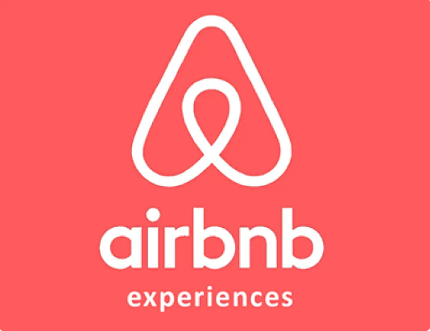

- **GetYourGuide**: Es una plataforma global de reservas en línea especializada en experiencias turísticas, tours y actividades en destinos de todo el mundo. Funciona como un mercado digital donde los viajeros pueden descubrir y reservar excursiones, visitas guiadas, entradas a atracciones y actividades únicas con proveedores locales.

  

- **Visit.org**: Visit.org es una plataforma global de reservas de experiencias de viaje con impacto social, que conecta a viajeros con tours y actividades operados por organizaciones sin fines de lucro (ONGs) y empresas sociales alrededor del mundo. Su objetivo es promover un turismo sostenible y responsable, donde el dinero gastado en experiencias beneficie directamente a comunidades locales y causas sociales.

  

2.1.1. Análisis competitivo.

<table>
  <tr>
    <th colspan="6" valign="top">Competitive Analysis Landscape</th>
  </tr>
  <tr>
    <td colspan="2" valign="top">¿Por qué llevar a cabo este análisis?</td>
    <td colspan="4" valign="top">El objetivo de este análisis es identificar las características de los competidores y encontrar maneras de diferenciarnos.</td>
  </tr>
  <tr>
    <td colspan="2" rowspan="2" valign="top">Startup y Competidores</td>
    <td valign="top">EcoTrip</td>
    <td valign="top">Airbnb Experiences</td>
    <td valign="top">GetYourGuide</td>
    <td valign="top">Visit.org</td>
  </tr>
  <tr>
    <td valign="top">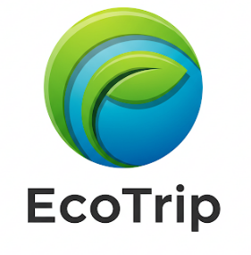</td>
    <td valign="top"></td>
    <td valign="top"></td>
    <td valign="top"></td>
  </tr>
  <tr>
    <td rowspan="2" valign="top">Perfil</td>
    <td valign="top">Overview</td>
    <td valign="top">Plataforma que conecta viajeros con experiencias sostenibles, auténticas y responsables, priorizando el impacto ambiental y comunitario.</td>
    <td valign="top">Plataforma de Airbnb para experiencias guiadas por locales (culturales, gastronómicas, etc.).</td>
    <td valign="top">Plataforma global para reservar tours y actividades guiadas.</td>
    <td valign="top">Plataforma que ofrece actividades con impacto social y ambiental junto a ONGs y empresas sociales.</td>
  </tr>
  <tr>
    <td valign="top">Ventaja competitiva ¿Qué valor ofrece a los clientes?</td>
    <td valign="top">Diseño de experiencias sostenibles, conexión con comunidades indígenas, guías multilingües, impacto positivo medible.</td>
    <td valign="top">Fuerte comunidad de anfitriones y viajeros; integración con su app de alojamiento.</td>
    <td valign="top">Gran cobertura y variedad de actividades urbanas en múltiples idiomas.</td>
    <td valign="top">Enfoque exclusivo en impacto social con ONGs verificadas.</td>
  </tr>
  <tr>
    <td rowspan="2" valign="top">Perfil de Marketing</td>
    <td valign="top">Mercado objetivo</td>
    <td valign="top">Turistas responsables, viajeros eco-conscientes y proveedores turísticos sostenibles.</td>
    <td valign="top">Millennials, turistas urbanos, viajeros espontáneos.</td>
    <td valign="top">Turistas internacionales y locales que buscan tours estructurados.</td>
    <td valign="top">Empresas que quieren promover el turismo con impacto social.</td>
  </tr>
  <tr>
    <td valign="top">Estrategias de marketing</td>
    <td valign="top">Alianzas con ONGs, influencers sostenibles, campañas educativas.</td>
    <td valign="top">Marketing por redes sociales, publicidad en la app, boca a boca.</td>
    <td valign="top">SEO, anuncios pagados, campañas de video marketing.</td>
    <td valign="top">Alianzas B2B con ONGs y empresas.</td>
  </tr>
  <tr>
    <td rowspan="3" valign="top">Perfil de Producto</td>
    <td valign="top">Productos & Servicios</td>
    <td valign="top">Experiencias, voluntariados, guías locales, itinerarios inteligentes.</td>
    <td valign="top">Experiencias locales, clases, tours y talleres.</td>
    <td valign="top">Tours, tickets a atracciones, visitas guiadas.</td>
    <td valign="top">Actividades solidarias y de impacto (voluntariado, talleres).</td>
  </tr>
  <tr>
    <td valign="top">Precios & Costos</td>
    <td valign="top">Comisión por reserva (transparente), servicios premium opcionales.</td>
    <td valign="top">Comisión en cada experiencia + tarifa del anfitrión.</td>
    <td valign="top">Comisión y precios fijos por actividad.</td>
    <td valign="top">Costos varían según la ONG; comisión para Visit.org.</td>
  </tr>
  <tr>
    <td valign="top">Canales de distribución (Web y/o Móvil)</td>
    <td valign="top">Web y/o móvil</td>
    <td valign="top">Web y App móvil</td>
    <td valign="top">Web y App móvil</td>
    <td valign="top">Web (limitado en app)</td>
  </tr>
  <tr>
    <td rowspan="4" valign="top">Análisis SWOT</td>
    <td valign="top">Fortalezas</td>
    <td valign="top">Enfoque ecológico y social, propuesta diferenciada, nicho emergente.</td>
    <td valign="top">Marca reconocida, red global, integración con hospedajes.</td>
    <td valign="top">Amplia oferta, multilenguaje, presencia global.</td>
    <td valign="top">Alta credibilidad social, alianza con ONGs, impacto real.</td>
  </tr>
  <tr>
    <td valign="top">Debilidades</td>
    <td valign="top">Plataforma nueva, baja visibilidad, dependencia de terceros.</td>
    <td valign="top">Algunas experiencias no verificadas, saturación de oferta.</td>
    <td valign="top">Falta de personalización, enfoque más comercial.</td>
    <td valign="top">Oferta limitada geográficamente, poca variedad.</td>
  </tr>
  <tr>
    <td valign="top">Oportunidades</td>
    <td valign="top">Creciente interés por el ecoturismo, apoyo a lo local, viajeros conscientes.</td>
    <td valign="top">Expansión de experiencias virtuales.</td>
    <td valign="top">Crecimiento del turismo.</td>
    <td valign="top">Aumento del interés por turismo con propósito.</td>
  </tr>
  <tr>
    <td valign="top">Amenazas</td>
    <td valign="top">Competencia consolidada, regulación turística, baja adopción tecnológica local.</td>
    <td valign="top">Legislación local, críticas por experiencias no auténticas.</td>
    <td valign="top">Competencia con Airbnb y nuevas plataformas.</td>
    <td valign="top">Bajo conocimiento de marca en algunos países.</td>
  </tr>
</table>

2.1.2. Estrategias y tácticas frente a competidores.

Las estrategias de EcoTrip frente a sus competidores son:

- Evaluación sostenible verificada: A diferencia de Airbnb o Lokafy, todas las experiencias en EcoTrip pasarán por una validación basada en criterios ambientales, sociales y culturales.

  - Tactica: Incluir testimonios de turistas responsables para reforzar la credibilidad de las experiencias.

- Asistencia personalizada con itinerarios inteligentes: Una herramienta gratuita para armar viajes a medida y un servicio premium para optimizar experiencias según presupuesto, tiempo e impacto.

  - Tactica: Desarrollar una herramienta digital(intinerario) gratuita (AppWeb) donde el usuario ingrese intereses de experiencias, tiempo y presupuesto.

- Servicio multilingüe y culturalmente contextualizado: Conexión entre turistas y guías que no solo hablen su idioma, sino que comprendan sus referencias culturales.

  - Tactica: Incluir en la plataforma una opción para solicitar un guía que entienda ciertos valores o estilos de viaje

- Modelo inclusivo para proveedores pequeños: Plan freemium para que guías y comunidades puedan tener presencia en la plataforma sin costo inicial.

  - Tactica: Ofrecer un plan gratuito con acceso básico a la plataforma, ideal para comunidades rurales o nuevos emprendimientos.

    2.2. Entrevistas.

    2.2.1. Diseño de entrevistas.

**Turistas Responsables**

- ¿Qué te motiva a viajar?
  (Explora si buscan aventura, relajación, conexión cultural, etc.)

- ¿Has participado antes en actividades de turismo sostenible o comunitario? ¿Cómo fue tu experiencia?

- ¿Qué factores tomas en cuenta al elegir un destino o experiencia turística?

- ¿Qué tan importante es para ti el impacto ambiental y social del lugar o actividad que visitas?

- ¿Qué canales usas normalmente para planear o reservar tus viajes? (Webs, apps, redes sociales, agencias, etc.)

- ¿Cuáles han sido tus principales frustraciones al buscar experiencias de viaje más auténticas o sostenibles?

- ¿Qué te haría confiar en una plataforma de turismo sostenible?

**Proveedores Sostenibles**

- ¿Cómo describirías los servicios o experiencias que ofreces a los turistas?

- ¿Qué te motivó a ofrecer experiencias turísticas sostenibles o comunitarias?

- ¿Cuáles son tus principales desafíos para atraer y conectar con turistas?

- ¿Qué medios usas actualmente para promocionar tus servicios? ¿Con qué frecuencia los usas?

- ¿Qué tipo de turistas suelen visitarte? ¿Qué valoran más de lo que ofreces?

- ¿Has tenido alguna experiencia con plataformas digitales de turismo? ¿Cómo fue?

- ¿Qué mejoras te gustaría ver en la forma de promocionar y gestionar tus experiencias?

  2.2.2. Registro de entrevistas.

#### Entrevista 1 - Cliente

**Entrevistador:** Anderson Gonza

**Entrevistado:** Salvador Salinas

Edad: 23 años

Ocupación: Programador freelance

Residencia: Lima, Perú

Duracion: 8:42

[**Link de la entrevista**](https://upcedupe-my.sharepoint.com/:v:/g/personal/u202120836_upc_edu_pe/EdIFRKsWsE5NkDlJaW2rn24BLqDtL3K0gaUY9ADINi2FhQ?nav=eyJyZWZlcnJhbEluZm8iOnsicmVmZXJyYWxBcHAiOiJPbmVEcml2ZUZvckJ1c2luZXNzIiwicmVmZXJyYWxBcHBQbGF0Zm9ybSI6IldlYiIsInJlZmVycmFsTW9kZSI6InZpZXciLCJyZWZlcnJhbFZpZXciOiJNeUZpbGVzTGlua0NvcHkifX0&e=Fkm3lW)

  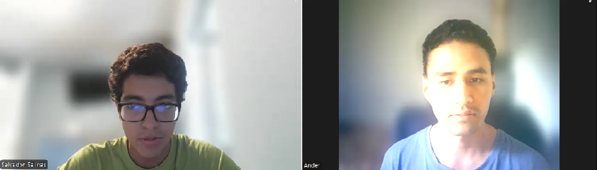

#### Resumen de la entrevista

Salvador es un programador freelance que viaja solo con mochila, buscando autenticidad y mínimo impacto ambiental. Ha hecho voluntariados de reforestación y organiza sus viajes desde su smartphone usando Instagram y blogs. Le frustra no encontrar fácilmente experiencias verdaderamente auténticas.

#### Entrevista 2 - Cliente

**Entrevistador:** Anderson Gonza

**Entrevistado:** Marcos

Edad: 20 años

Ocupación: Estudiante de Ingeniería Ambiental

Residencia: Lima, Perú

Duracion: 6:12

[**Link de la entrevista**](https://upcedupe-my.sharepoint.com/:v:/g/personal/u202120836_upc_edu_pe/Ecn81ZUtC0lIkv0iftk907QBCUFv5cW5h4287FDTk1YFZg?nav=eyJyZWZlcnJhbEluZm8iOnsicmVmZXJyYWxBcHAiOiJPbmVEcml2ZUZvckJ1c2luZXNzIiwicmVmZXJyYWxBcHBQbGF0Zm9ybSI6IldlYiIsInJlZmVycmFsTW9kZSI6InZpZXciLCJyZWZlcnJhbFZpZXciOiJNeUZpbGVzTGlua0NvcHkifX0&e=rXdblg)

  

#### Resumen de la entrevista

Marcos estudia ingeniería ambiental y viaja para aprender y colaborar directamente en conservación. Ha trabajado en rescates de animales en la selva y busca proyectos donde pueda involucrarse de verdad. Le molesta la falta de transparencia sobre el impacto real de muchas experiencias turísticas.

#### Entrevista 3 - Cliente

**Entrevistador:** Anderson Gonza

**Entrevistado:** Oscar

Edad: 22 años

Ocupación: Estudiante de Administración de Empresas

Residencia: Lima, Perú

Duracion: 5:24

[**Link de la entrevista**](https://upcedupe-my.sharepoint.com/:v:/g/personal/u202120836_upc_edu_pe/EeFNDUDzBBxHk-pqT2t1R4kBIZztjxTs9ATdjn360LJ90g?nav=eyJyZWZlcnJhbEluZm8iOnsicmVmZXJyYWxBcHAiOiJPbmVEcml2ZUZvckJ1c2luZXNzIiwicmVmZXJyYWxBcHBQbGF0Zm9ybSI6IldlYiIsInJlZmVycmFsTW9kZSI6InZpZXciLCJyZWZlcnJhbFZpZXciOiJNeUZpbGVzTGlua0NvcHkifX0&e=yI1daS)

  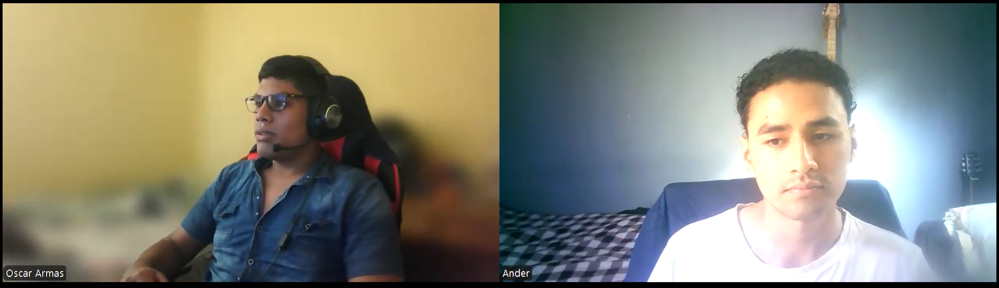

#### Resumen de la entrevista

Oscar, estudiante de administración, viaja con amigos para desconectarse de la rutina. Le gustan los destinos únicos y económicos, y aunque antes no pensaba en el impacto social o ambiental, ahora sí lo valora. Se inspira en TikTok e Instagram, pero le cuesta confiar en que las experiencias sean realmente sostenibles.

#### Entrevista 4 - Provedor

**Entrevistador:** Anderson Gonza

**Entrevistado:** Joaquin

Edad: 27 años

Rol: Propietario de un ecohostal en Oxapampa

Tipo: Emprendimiento ecológico privado

Duracion: 4:54

[**Link de la entrevista**](https://upcedupe-my.sharepoint.com/:v:/g/personal/u202120836_upc_edu_pe/EVwxh00o199Mt8Xyh5limHABwAnrKvxi8nO9BWHetalSrA?nav=eyJyZWZlcnJhbEluZm8iOnsicmVmZXJyYWxBcHAiOiJPbmVEcml2ZUZvckJ1c2luZXNzIiwicmVmZXJyYWxBcHBQbGF0Zm9ybSI6IldlYiIsInJlZmVycmFsTW9kZSI6InZpZXciLCJyZWZlcnJhbFZpZXciOiJNeUZpbGVzTGlua0NvcHkifX0&e=Oa3bhT)

  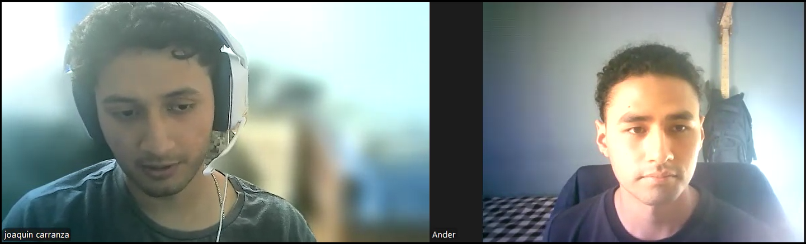

#### Resumen de la entrevista

Joaquín dirige un ecohostal en Oxapampa donde mezcla naturaleza, gastronomía local y rutas poco conocidas. Aunque Airbnb e Instagram lo ayudan a atraer turistas, le gustaría menos dependencia de plataformas y más apoyo para destacar su propuesta ecológica auténtica.

#### Entrevista 5 - Provedor

**Entrevistador:** Anderson Gonza

**Entrevistado:** Lizeth

Edad: 26 años

Rol: Coordinadora de programas de conservación en una ONG ambiental en Tarapoto.

Tipo: Organización sin fines de lucro

Duracion: 3:47

[**Link de la entrevista**](https://upcedupe-my.sharepoint.com/:v:/g/personal/u202120836_upc_edu_pe/EUwfonQnWXVLoY9hKMP6mxMBNzYCQ68ym8faLh5DOd50xA?nav=eyJyZWZlcnJhbEluZm8iOnsicmVmZXJyYWxBcHAiOiJPbmVEcml2ZUZvckJ1c2luZXNzIiwicmVmZXJyYWxBcHBQbGF0Zm9ybSI6IldlYiIsInJlZmVycmFsTW9kZSI6InZpZXciLCJyZWZlcnJhbFZpZXciOiJNeUZpbGVzTGlua0NvcHkifX0&e=Z8aIda)

  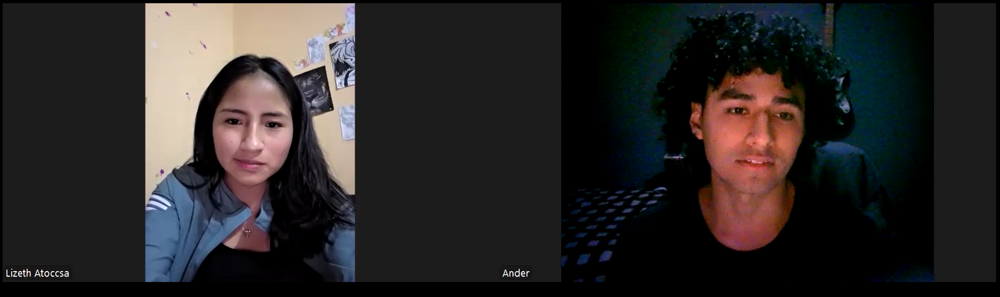

#### Resumen de la entrevista

Lizet coordina voluntariados de conservación en Tarapoto a través de una ONG. Trabaja duro para acercar a jóvenes a causas ambientales reales, pero a veces le cuesta transmitir el valor de estas experiencias. Sueña con una red que priorice proyectos pequeños con impacto genuino.

#### Entrevista 6 - Provedor

**Entrevistador:** Anderson Gonza

**Entrevistado:** Luis Quispe

Edad: 25 años

Rol: Líder joven de una comunidad que ofrece caminatas con guías locales en Cusco.

Tipo: Comunidad rural

Duracion: 2:42

[**Link de la entrevista**](https://upcedupe-my.sharepoint.com/:v:/g/personal/u202120836_upc_edu_pe/EUdLuGiA06VDpBGteTFbhyIB_9ZJuZgivAOjZQ8Jj0vthA?nav=eyJyZWZlcnJhbEluZm8iOnsicmVmZXJyYWxBcHAiOiJPbmVEcml2ZUZvckJ1c2luZXNzIiwicmVmZXJyYWxBcHBQbGF0Zm9ybSI6IldlYiIsInJlZmVycmFsTW9kZSI6InZpZXciLCJyZWZlcnJhbFZpZXciOiJNeUZpbGVzTGlua0NvcHkifX0&e=6TbLRD)

  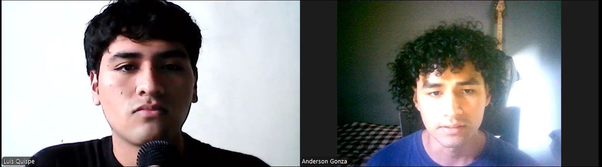

#### Resumen de la entrevista

Luis lidera una comunidad en Cusco que ofrece caminatas ancestrales y talleres culturales. Su gran reto es competir con agencias grandes y hacerse visible online. Usa Instagram y WhatsApp, y quisiera que se reconozca más el valor real de las experiencias comunitarias.

2.2.3. Análisis de entrevistas.

### Segmento: Turistas Jóvenes

#### Perfil General:

Edad: 20 a 23 años

Residencia: Lima, Perú

Ocupación: Estudiantes universitarios y profesionales jóvenes

Modalidad de viaje: Viajan solos o en grupos de amigos

Motivaciones de viaje: Búsqueda de experiencias auténticas, conexión con la naturaleza y aprendizaje cultural​

#### Características Comunes:

Conciencia ambiental: Muestran preocupación por el impacto ambiental y social de sus viajes.

Participación en turismo sostenible: El 100% ha participado en actividades de turismo sostenible o comunitario.

Canales de planificación: Todos utilizan redes sociales y plataformas digitales para planificar sus viajes.

Frustraciones comunes: El 100% expresa dificultades para identificar experiencias verdaderamente sostenibles y evitar el "greenwashing"(publicidad engañosa).

### Segmento: Proveedores de Turismo Sostenible

#### Perfil General:

Edad: 25 a 30 años

Ubicación: Regiones como Cusco, Oxapampa y Tarapoto

Tipo de organización: Comunidad rural, emprendimiento ecológico privado y ONG ambiental

Roles: Líder comunitario, propietario de ecohostal y coordinador de programas de conservación​

#### Características Comunes:

Oferta de servicios: El 100% ofrece experiencias auténticas que incluyen actividades culturales, educativas y de conservación.

Motivación: Todos están motivados por la preservación cultural y ambiental, así como por el desarrollo sostenible de sus comunidades.

Canales de promoción: Todos utilizan plataformas digitales como Instagram, Airbnb y Booking para promocionar sus servicios.

Desafíos comunes: El 100% enfrenta dificultades para competir con grandes operadores turísticos y lograr visibilidad en plataformas digitales.​

##  2.3. Needfinding

Con el propósito de desarrollar una app que satisfaga las necesidades particulares de los usuarios, Ecotrip llevará a cabo la identificación del User persona, User Task Matrix, User Journey Maps y Empathy Mapping.

###  2.3.1. User Personas

Para esta sección se han creado personajes ficticios, cada uno diseñado para representar a un segmento específico de usuarios. La información utilizada para desarrollar estos "User personas" proviene de entrevistas previas realizadas a cada segmento objetivo. Estas entrevistas tenían como objetivo comprender mejor a las personas a las que se dirige la aplicación. Se consideraron datos demográficos, metas, motivaciones, frustraciones, marcas relacionadas con el tema de la aplicación, canales digitales más utilizados, entre otros. La creación de esta sección se llevó a cabo utilizando la plataforma UXPressia.

- **Segmento objetivo: Turista responsable**

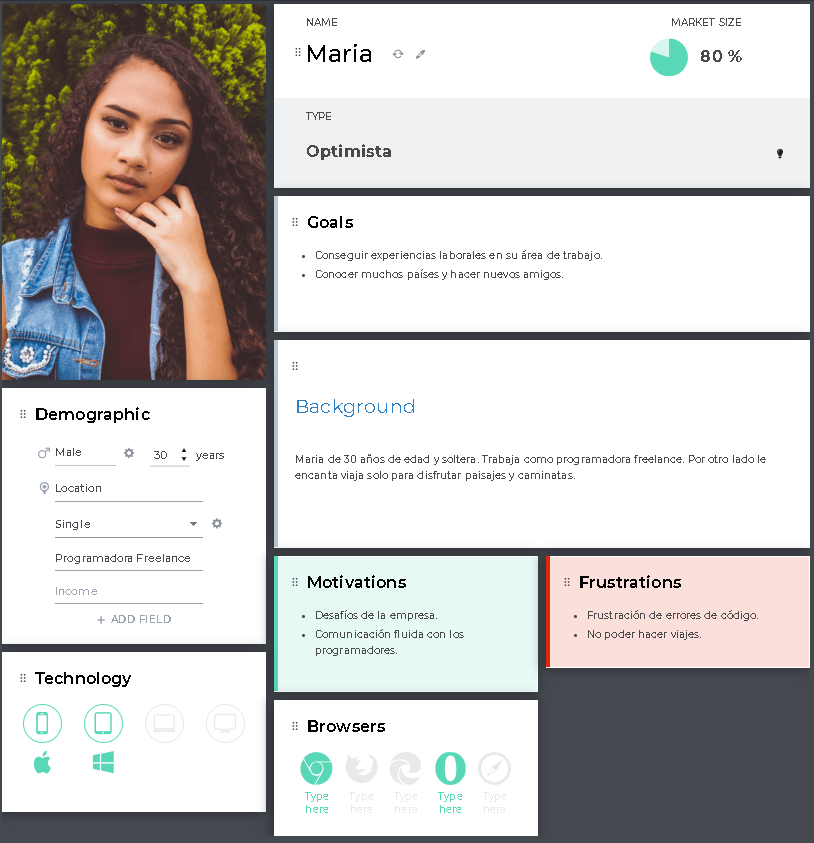

- **Segmento objetivo: Proveedor turístico sostenible**

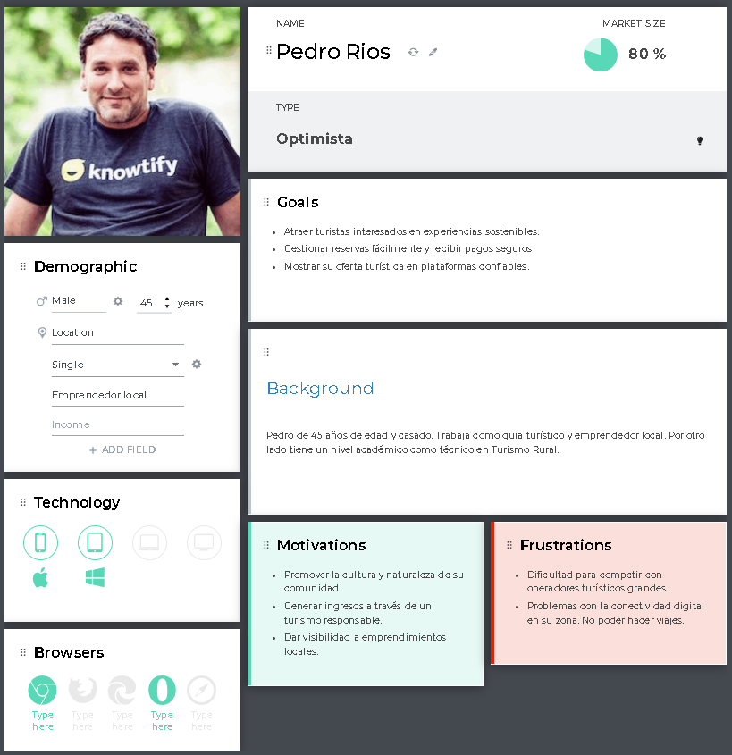

###  2.3.2. User Task Matrix

En esta sección se presenta el User Task Matrix, una herramienta centrada en nuestros dos segmentos objetivos principales: el Turista Responsable y el Proveedor Turístico Sostenible. Esta matriz permite identificar y comparar las tareas clave que cada usuario realiza o espera realizar en la plataforma.

<table border="1" cellspacing="0" cellpadding="8">
  <tr>
    <th><b><i>User Task Matrix</i></b></th>
    <th><b><i>Lucía (Turista Responsable)</i></b></th>
    <th><b><i>Pedro (Proveedor Turístico)</i></b></th>
  </tr>
  <tr>
    <td>Buscar experiencias sostenibles</td>
    <td style="text-align: center;"><i>Alta</i></td>
    <td style="text-align: center;"><i>No aplica</i></td>
  </tr>
  <tr>
    <td>Filtrar experiencias por ubicación/interés</td>
    <td style="text-align: center;"><i>Alta</i></td>
    <td style="text-align: center;"><i>No aplica</i></td>
  </tr>
  <tr>
    <td>Ver perfil y calificaciones del proveedor</td>
    <td style="text-align: center;"><i>Media</i></td>
    <td style="text-align: center;"><i>No aplica</i></td>
  </tr>
  <tr>
    <td>Reservar una experiencia</td>
    <td style="text-align: center;"><i>Alta</i></td>
    <td style="text-align: center;"><i>No aplica</i></td>
  </tr>
  <tr>
    <td>Crear y publicar una experiencia</td>
    <td style="text-align: center;"><i>No aplica</i></td>
    <td style="text-align: center;"><i>Alta</i></td>
  </tr>
  <tr>
    <td>Gestionar reservas recibidas</td>
    <td style="text-align: center;"><i>No aplica</i></td>
    <td style="text-align: center;"><i>Alta</i></td>
  </tr>
  <tr>
    <td>Recibir pagos por experiencias</td>
    <td style="text-align: center;"><i>No aplica</i></td>
    <td style="text-align: center;"><i>Alta</i></td>
  </tr>
  <tr>
    <td>Editar información de su perfil</td>
    <td style="text-align: center;"><i>Media</i></td>
    <td style="text-align: center;"><i>Media</i></td>
  </tr>
  <tr>
    <td>Chatear con otros usuarios</td>
    <td style="text-align: center;"><i>Media</i></td>
    <td style="text-align: center;"><i>Media</i></td>
  </tr>
  <tr>
    <td>Calificar experiencias</td>
    <td style="text-align: center;"><i>Alta</i></td>
    <td style="text-align: center;"><i>Baja</i></td>
  </tr>
  <tr>
    <td>Acceder a soporte o ayuda</td>
    <td style="text-align: center;"><i>Media</i></td>
    <td style="text-align: center;"><i>Media</i></td>
  </tr>
</table>

Esta clasificación facilita la priorización de características durante la construcción del Product Backlog, asegurando que se enfoquen primero las funcionalidades más relevantes para cada tipo de usuario. Además, el análisis comparativo permite visualizar las similitudes, diferencias, y oportunidades entre ambos perfiles.

###  2.3.3. User Journey Mapping

En esta sección, se describen en detalle los User Journey Mapping para dos perfiles distintos de usuarios de la plataforma de turismo responsable: los Turistas Ocasionales y los Turistas Frecuentes. Estos mapas proporcionan una visión integral del recorrido que cada tipo de usuario realiza dentro del sistema, desde el primer contacto con la plataforma hasta su uso habitual y su interacción continua con las funcionalidades ofrecidas. Se destacan las etapas clave, las emociones y necesidades específicas de cada usuario, para asegurar una comprensión clara de su experiencia global.

_Para Turista Responsable_

- El recorrido de Lucía comienza motivado por su interés en descubrir experiencias sostenibles, auténticas y respetuosas con el entorno local. Su primer contacto con la plataforma suele darse a través de búsquedas en Google, recomendaciones de amigos o redes sociales.

- Una vez en la plataforma, explora experiencias disponibles, filtra por destino e impacto ambiental, y se registra para poder reservar. Lucía valora una navegación clara y confiable, con información transparente sobre sostenibilidad, seguridad y beneficios locales.
- Tras reservar y vivir la experiencia, suele dejar una reseña, evaluar al proveedor y, si su experiencia fue positiva, volver a utilizar la plataforma en futuros viajes. También le interesa guardar tours y recibir recomendaciones personalizadas según sus intereses.

_Para Proveedor Turístico Sostenible_

- El viaje de Pedro inicia cuando busca una forma de dar visibilidad a sus experiencias locales sin intermediarios tradicionales. Descubre la plataforma a través de un correo de invitación, recomendación de otro proveedor o una publicación en redes profesionales.
- Se registra y configura su perfil de proveedor. Publica sus experiencias detallando impacto social, logístico y ambiental. Necesita un panel sencillo para subir fotos, definir precios y gestionar reservas.
- Una vez que los turistas comienzan a reservar, Pedro gestiona la disponibilidad, responde consultas y organiza la logística. Después del tour, revisa las reseñas y ajusta su oferta según los comentarios. Busca construir una reputación confiable, ya que esto influye directamente en su visibilidad dentro de la plataforma.

Aunque tienen objetivos distintos, ambos comparten una motivación común: participar activamente en un turismo más consciente, auténtico y sostenible. Sus recorridos reflejan roles complementarios dentro del ecosistema de la plataforma.

- #### _Turista Responsable_

  | Etapa                    | Acción del usuario (Turista ocasional)       | Emoción      | Canal               | Oportunidad de mejora                          |
  | ------------------------ | -------------------------------------------- | ------------ | ------------------- | ---------------------------------------------- |
  | Descubrimiento           | Encuentra la plataforma por redes o buscador | Curiosidad   | Web, redes sociales | Mejorar posicionamiento SEO y contenido visual |
  | Registro                 | Se registra para ver detalles de un tour     | Interés      | Página web          | Simplificar el proceso de registro             |
  | Exploración              | Navega tours sin un objetivo claro           | Confusión    | Navegador           | Sugerencias iniciales según localización       |
  | Reserva                  | Selecciona y reserva un tour                 | Satisfacción | Página de reservas  | Ofrecer asistencia en tiempo real              |
  | Participación en el tour | Asiste a la actividad                        | Entusiasmo   | Presencial          | Recordatorios y checklist antes del tour       |
  | Post-experiencia         | Puede dejar una reseña o no                  | Desconexión  | Email, web          | Incentivar feedback con recompensas            |

- #### _Proveedor Turístico Sostenible_
  | Etapa            | Acción del usuario (Turista frecuente)                             | Emoción                           | Canal                             | Oportunidad de mejora                                      |
  | ---------------- | ------------------------------------------------------------------ | --------------------------------- | --------------------------------- | ---------------------------------------------------------- |
  | Descubrimiento   | Conoce la plataforma a través de otros guías, redes o invitaciones | EntusCuriosidad, escepticismoasmo | Facebook, WhatsApp, web           | Campañas de captación con testimonios de otros proveedores |
  | Registro         | Se registra como proveedor, completa perfil y verifica identidad   | Motivación, dudas técnicas        | Formulario, email de verificación | Proceso guiado, soporte en línea, validación rápida        |
  | Publicación      | Crea y publica una experiencia con fotos, texto y precio           | Creatividad, expectativa          | Dashboard proveedor               | Asistente de publicación, plantillas prediseñadas          |
  | Gestión          | Recibe reservas, responde dudas, organiza logística del tour       | Organización, estrés              | Panel de reservas, mensajería     | Sistema de alertas, app móvil para gestión rápida          |
  | Entrega del tour | Da la experiencia presencialmente                                  | Entusiasmo                        | WhatsApp, en persona              | Confirmación previa, herramientas de check-in              |
  | Retención        | Publica nuevas experiencias, busca subir su reputación             | Motivación, compromiso            | Email, plataforma                 | Enviar reportes de desempeño, sugerencias automáticas      |

###  2.3.4. Empathy Mapping

En esta sección se presenta el Empathy Mapping, una herramienta esencial para construir perfiles detallados de los dos principales user personas de la plataforma: Lucía, Turista Responsable, y Pedro, Proveedor Turístico Sostenible.

El objetivo es comprender de forma profunda sus pensamientos, emociones, comportamientos y motivaciones al interactuar con la plataforma. Para ello, se analiza lo que cada usuario ve, oye, dice, hace y siente, además de identificar sus dolores (pains) y beneficios esperados (gains).

Este ejercicio permite empatizar con sus contextos reales, facilitando el diseño de funcionalidades centradas en las verdaderas necesidades de cada segmento.

- **Segmento: Turista Responsable**

| Etapa                | Registro                           | Búsqueda de tours                           | Reserva                                   | Experiencia del tour                 | Revisión y seguimiento                   |
| -------------------- | ---------------------------------- | ------------------------------------------- | ----------------------------------------- | ------------------------------------ | ---------------------------------------- |
| **User goals**       | Acceder sin complicaciones         | Encontrar opciones auténticas y sostenibles | Reservar sin repetir pasos                | Vivir una experiencia local única    | Compartir su experiencia y evaluar       |
| **Touchpoints**      | Formulario simple, login social    | Buscador con filtros y etiquetas            | Pasarela intuitiva, historial de reservas | Confirmaciones, contacto con guía    | Email post-tour, botón para dejar reseña |
| **Customer Thought** | “Quiero empezar sin perder tiempo” | “¿Qué lugares realmente valen la pena?”     | “¿Mi pago está protegido?”                | “¿Será como lo prometieron?”         | “¿Cómo ayudo a otros viajeros como yo?”  |
| **Experience**       | 🙂 Fluida y amigable               | 🙂 Interesante y consciente                 | 😄 Confiable y directa                    | 😄 Auténtica y enriquecedora         | 😄 Gratificante y útil                   |
| **Ideas/Opps**       | Autocompletar desde Gmail          | Etiquetas como ‘eco-friendly’, ‘local’      | Pago en un clic con billetera digital     | Asistente virtual para dudas rápidas | Recompensa por dejar reseñas             |

- **Segmento: Proveedor Turístico Sostenible**

| Etapa                | Registro                             | Publicación de tour                  | Gestión de reservas                   | Ejecución del tour                      | Evaluación y continuidad                  |
| -------------------- | ------------------------------------ | ------------------------------------ | ------------------------------------- | --------------------------------------- | ----------------------------------------- |
| **User goals**       | Registrar su oferta fácilmente       | Describir su tour de forma atractiva | Organizar sin errores ni olvidos      | Dar una experiencia memorable y segura  | Recibir feedback, mejorar y seguir activo |
| **Touchpoints**      | Registro con ayuda paso a paso       | Panel con plantilla de tours         | Calendario, notificaciones, chat      | Checklist del día, contacto con turista | Plataforma de evaluación, estadísticas    |
| **Customer Thought** | “¿Será complicado llenar todo esto?” | “¿Mi tour llama la atención?”        | “¿Todo está confirmado y claro?”      | “¿Los turistas estarán satisfechos?”    | “¿Estoy creciendo en la plataforma?”      |
| **Experience**       | 🙂 Simple y bien guiada              | 🙂 Creativa pero necesita apoyo      | 🙂 Organizada y clara                 | 😄 Profesional y con buen feedback      | 😄 Motivadora y constructiva              |
| **Ideas/Opps**       | Tutorial interactivo                 | Asistente para redacción atractiva   | App móvil para gestión en tiempo real | Confirmación de llegada del turista     | Tips automáticos para mejorar perfil      |

###  2.3.5. As-is Scenario Mapping

En esta sección se presenta el As-Is Scenario Mapping para cada uno de los segmentos objetivos identificados: Turista Responsable y Proveedor Turístico Sostenible. Este análisis tiene como objetivo visualizar cómo estos usuarios interactúan actualmente con plataformas digitales al planificar, ofrecer o reservar experiencias de viaje, y así detectar oportunidades de mejora, frustraciones comunes y necesidades no cubiertas.

Para este mapeo se han considerado cinco fases clave del recorrido del usuario: Descubrimiento, Evaluación, Reserva, Experiencia y Seguimiento. En cada etapa se identifican acciones típicas, aspectos positivos, dificultades experimentadas y oportunidades que pueden guiar el diseño de funcionalidades relevantes para nuestra plataforma de turismo responsable.

El análisis se basa en entrevistas y observaciones realizadas durante la fase de investigación, complementadas con supuestos validados por referencias externas, permitiendo entender el contexto actual y orientar decisiones estratégicas centradas en el usuario.

_As-is Scenario mapping: Turista Responsable_

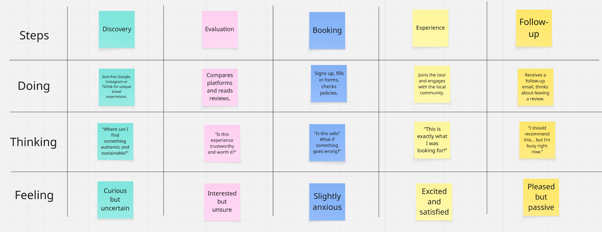

_As-is Scenario mapping: Proveedor Turístico Sostenible_

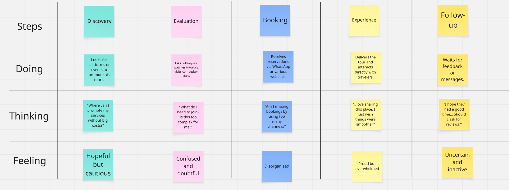

Capítulo III: Requirements Specification

3.1. To-Be Scenario Mapping.

3.2. User Stories.

3.3. Impact Mapping.

#### Mapa de segmento turistas responsable:

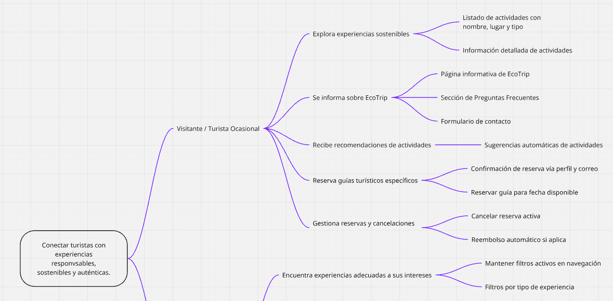

#### Mapa de segmento proveedores turisticos ecologicos:

3.4. Product Backlog.

| ID      | Título                                         | Prioridad | Descripción                                                                                    |
| ------- | ---------------------------------------------- | --------- | ---------------------------------------------------------------------------------------------- |
| US-01   | Ver lista de experiencias sostenibles          | Alta      | Como turista ocasional quiero ver una lista de experiencias para explorar qué ofrece EcoTrip.  |
| US-01.1 | Filtrar experiencias por tipo                  | Alta      | Como turista frecuente quiero filtrar experiencias por tipo para encontrar lo que me interesa. |
| US-02   | Registro de proveedores                        | Alta      | Como proveedor quiero registrarme para ofrecer mis servicios turísticos sostenibles.           |
| US-02.1 | Aprobación de proveedor                        | Alta      | Como administrador quiero revisar y aprobar solicitudes de proveedores.                        |
| US-03   | Crear plan de viaje personalizado              | Media     | Como turista frecuente quiero armar mi propio itinerario con actividades y hospedajes.         |
| US-03.1 | Sugerencias de itinerario basadas en intereses | Media     | Como turista ocasional quiero recibir sugerencias de actividades según mi perfil.              |
| US-04   | Conexión con guías turísticos                  | Alta      | Como turista frecuente quiero contactar guías que hablen mi idioma.                            |
| US-04.1 | Reservar guía específico                       | Media     | Como turista ocasional quiero poder reservar a un guía en específico.                          |
| US-05   | Reservar y pagar experiencias                  | Alta      | Como turista frecuente quiero reservar y pagar actividades de manera fácil.                    |
| US-05.1 | Cancelar reserva y recibir reembolso           | Media     | Como turista ocasional quiero cancelar mi reserva si no podré asistir.                         |
| US-06   | Página informativa sobre EcoTrip               | Media     | Como visitante quiero saber qué es EcoTrip y qué servicios ofrece.                             |
| US-06.1 | Ver testimonios de otros viajeros              | Baja      | Como visitante quiero leer opiniones para confiar en la plataforma.                            |
| US-07   | Gestión del portafolio de proveedores          | Alta      | Como proveedor quiero agregar, editar o eliminar mis experiencias.                             |
| US-08   | Mejorar visibilidad de proveedores             | Media     | Como proveedor quiero mostrar mis calificaciones y reseñas públicas.                           |
| US-09   | Registro y validación fácil para proveedores   | Alta      | Como proveedor quiero un proceso de registro rápido y sencillo.                                |
| US-10   | Recibir pagos seguros como proveedor           | Alta      | Como proveedor quiero recibir mis pagos de manera segura y poder ver mi historial.             |

Capítulo IV: Product Design

4.1. Style Guidelines.

4.1.1. General Style Guidelines.

4.1.2. Web Style Guidelines.

4.2. Information Architecture.

4.2.1. Organization Systems.

4.2.2. Labeling Systems.

4.2.3. SEO Tags and Meta Tags

4.2.4. Searching Systems.

4.2.5. Navigation Systems.

4.3. Landing Page UI Design.

4.3.1. Landing Page Wireframe.

4.3.2. Landing Page Mock-up.

4.4. Web Applications UX/UI Design.

En esta seccion se presentaran los wireframes y mock-ups de la aplicacion web.

4.4.1. Web Applications Wireframes.

4.4.2. Web Applications Wireflow Diagrams.

Se adjunta el link de lucidchart https://lucid.app/lucidchart/3388aa61-c9d7-4ea5-b07a-c336cde96596/edit?viewport_loc=-1485%2C1449%2C8552%2C4006%2C0_0&invitationId=inv_be371db9-279a-4ba4-8a9f-60ce9f108df5

4.4.3. Web Applications Mock-ups.

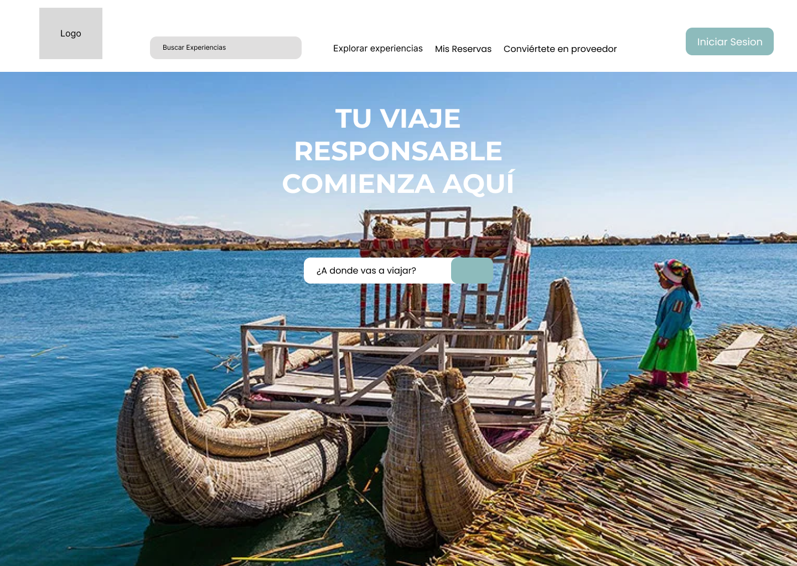

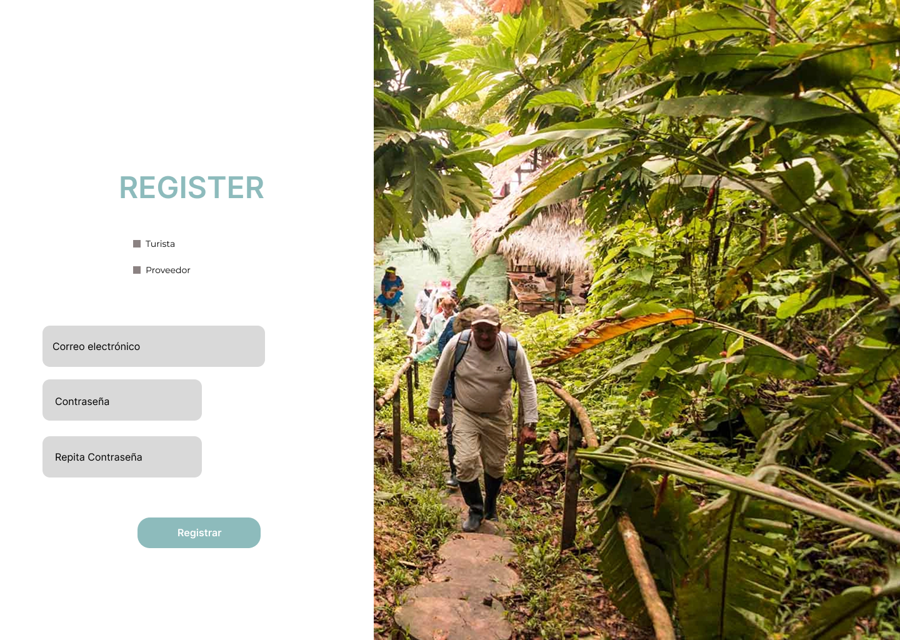

4.4.4. Web Applications User Flow Diagrams.

Se adjunta el link de lucidchart https://lucid.app/lucidchart/d14987cc-bb04-4407-bde7-c9ce172c96c4/edit?viewport_loc=-5452%2C3770%2C10959%2C5134%2C0_0&invitationId=inv_623075fb-44b7-4c97-939c-7a03784fb502

4.5. Web Applications Prototyping.

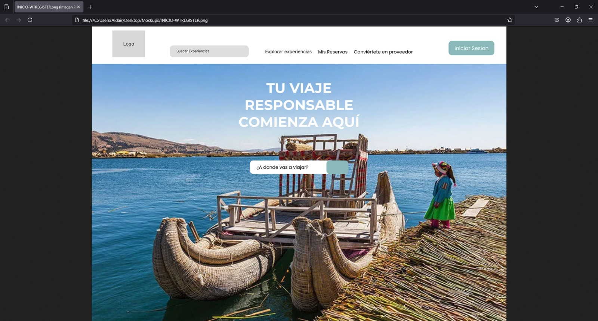

4.6. Domain-Driven Software Architecture.

4.6.1. Software Architecture Context Diagram.

4.6.2. Software Architecture Container Diagrams.

4.6.3. Software Architecture Components Diagrams.

4.7. Software Object-Oriented Design.

4.7.1. Class Diagrams.

Se realizo el diagrama de clases

  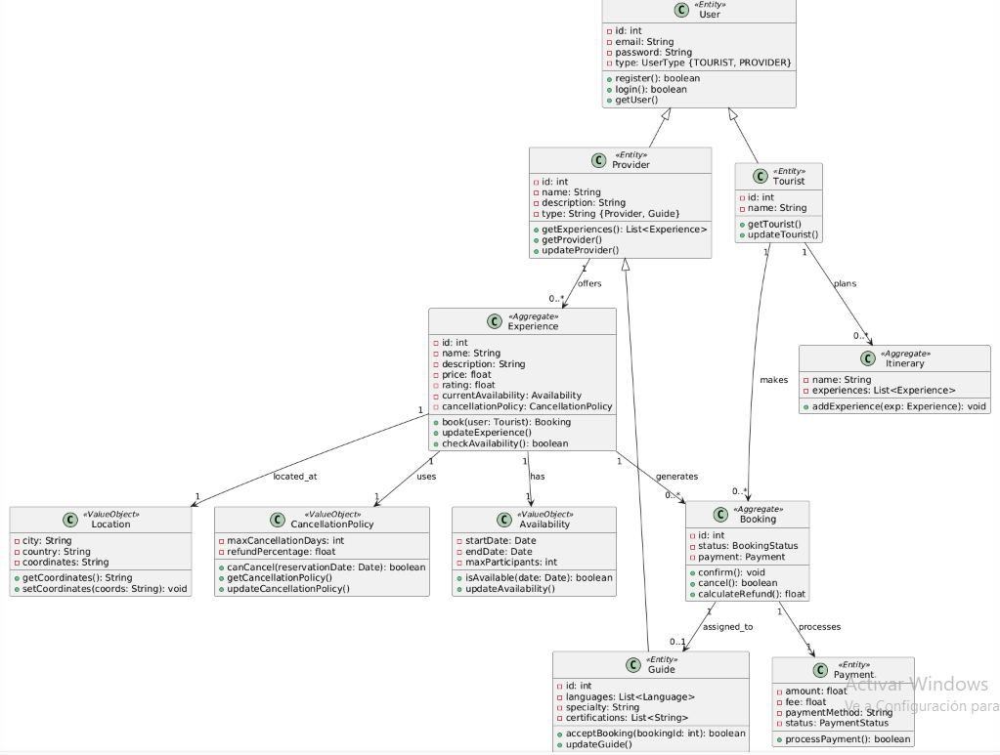

4.7.2. Class Dictionary.

A continuación, se especificara más a detalle sobre cada una de las clases.

## `User` (Entidad)

Clase base para todos los usuarios del sistema.

### Atributos

- `id: int` - Identificador único del usuario
- `email: String` - Correo electrónico del usuario (credencial de inicio de sesión)
- `password: String` - Contraseña encriptada
- `type: UserType {TOURIST, PROVIDER}` - Rol del usuario

### Métodos

- `register()` - Crea una nueva cuenta de usuario
- `login()` - Autentica las credenciales del usuario
- `getUser()` - Retorna los datos del perfil del usuario

---

## `Tourist` (Entidad)

Representa a los viajeros que usan la plataforma.

### Atributos

- `id: int` - Identificador único del turista
- `name: String` - Nombre completo del turista

### Métodos

- `getTourist()` - Retorna los detalles del turista
- `updateTourist()` - Modifica la información del perfil

---

## `Provider` (Entidad)

Clase base para los proveedores de experiencias.

### Atributos

- `id: int` - Identificador único del proveedor
- `name: String` - Nombre del negocio
- `description: String` - Descripción del proveedor
- `type: String {Provider, Guide}` - Especialización del proveedor

### Métodos

- `getProvider()` - Retorna los detalles del proveedor
- `updateProvider()` - Edita la información del proveedor
- `getExperiences()` - Lista todas las experiencias ofrecidas

---

## `Guide` (Entidad)

Proveedor especializado en experiencias guiadas.

### Atributos

- `id: int` - Identificador único del guía
- `languages: List<Language>` - Idiomas hablados por el guía
- `specialty: String` - Área de especialización (ej. "Vida silvestre", "Historia")
- `certifications: List<String>` - Certificaciones profesionales

### Métodos

- `acceptBooking(bookingId: int)` - Confirma la asignación de una reserva
- `updateGuide()` - Modifica el perfil del guía

---

## `Experience` (Agregado)

Actividad de turismo sostenible reservable.

### Atributos

- `id: int` - Identificador único de la experiencia
- `name: String` - Nombre de la actividad (ej. "Tour en kayak por el Amazonas")
- `description: String` - Descripción detallada
- `price: float` - Costo por participante
- `rating: float` - Calificación promedio de los usuarios (1-5)
- `currentAvailability: Availability` - Disponibilidad para reservas
- `cancellationPolicy: CancellationPolicy` - Reglas de reembolso

### Métodos

- `book(user: Tourist)` - Crea una nueva reserva
- `updateExperience()` - Modifica los detalles de la actividad
- `checkAvailability()` - Verifica los espacios disponibles

---

## `Booking` (Agregado)

Reserva confirmada de una experiencia.

### Atributos

- `id: int` - Identificador único de la reserva
- `status: BookingStatus` - Estado actual (Pendiente/Confirmada/Cancelada)
- `payment: Payment` - Detalles de la transacción

### Métodos

- `confirm()` - Finaliza la reserva
- `cancel()` - Inicia la cancelación
- `calculateRefund()` - Determina el monto del reembolso

---

## `Payment` (Entidad)

Registro de transacción financiera.

### Atributos

- `amount: float` - Monto total pagado
- `fee: float` - Comisión por servicio de la plataforma
- `paymentMethod: String` - Método de pago (tarjeta, PayPal, etc.)
- `status: PaymentStatus` - Estado de la transacción

### Métodos

- `processPayment()` - Ejecuta el pago

---

## `Itinerary` (Agregado)

Viaje planificado del viajero.

### Atributos

- `name: String` - Título del itinerario
- `experiences: List<Experience>` - Actividades seleccionadas

### Métodos

- `addExperience(exp: Experience)` - Incluye una nueva actividad

---

## `Location` (Objeto de Valor)

Coordenadas geográficas.

### Atributos

- `city: String` - Nombre de la ciudad
- `country: String` - Nombre del país
- `coordinates: String` - Latitud/Longitud

### Métodos

- `getCoordinates()` - Retorna las coordenadas formateadas
- `setCoordinates(coords: String)` - Actualiza la ubicación

---

## `CancellationPolicy` (Objeto de Valor)

Reglas de reembolso para reservas.

### Atributos

- `maxCancellationDays: int` - Plazo para cancelación gratuita
- `refundPercentage: float` - Porcentaje de reembolso parcial

### Métodos

- `canCancel(reservationDate: Date)` - Verifica si se permite la cancelación
- `getCancellationPolicy()` - Retorna los detalles de la política
- `updateCancellationPolicy()` - Modifica los términos

---

## `Availability` (Objeto de Valor)

Intervalos de tiempo disponibles para reservas.

### Atributos

- `startDate: Date` - Fecha de inicio de disponibilidad
- `endDate: Date` - Fecha de fin de disponibilidad
- `maxParticipants: int` - Límite de capacidad

### Métodos

- `isAvailable(date: Date)` - Verifica la disponibilidad en una fecha
- `updateAvailability()` - Modifica los periodos de disponibilidad

  4.8. Database Design.

  4.8.1. Database Diagram.

  A continuación, se muestra el diagrama de la base de datos relacional.

    

    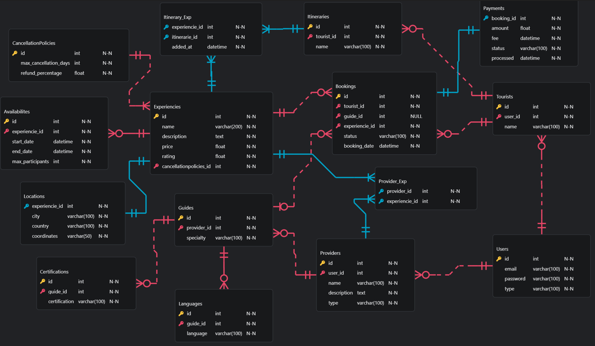
  

Capítulo V: Product Implementation, Validation & Deployment

5.1. Software Configuration Management.

5.1.1. Software Development Environment Configuration.

5.1.2. Source Code Management.

5.1.3. Source Code Style Guide & Conventions.

5.1.4. Software Deployment Configuration.

5.2. Landing Page, Services & Applications Implementation.

5.2.X. Sprint n

5.2.X.1. Sprint Planning n.

5.2.X.2. Aspect Leaders and Collaborators.

5.2.X.3. Sprint Backlog n.

5.2.X.4. Development Evidence for Sprint Review.

5.2.X.5. Execution Evidence for Sprint Review.

5.2.X.6. Services Documentation Evidence for Sprint Review.

5.2.X.7. Software Deployment Evidence for Sprint Review.

5.2.X.8. Team Collaboration Insights during Sprint.

7/35

5.3. Validation Interviews.

5.3.1. Diseño de Entrevistas.

5.3.2. Registro de Entrevistas.

5.3.3. Evaluaciones según heurísticas.

5.4. Video About-the-Product.

Conclusiones
Conclusiones y recomendaciones.
Video About-the-Team.
Bibliografía
Anexos
